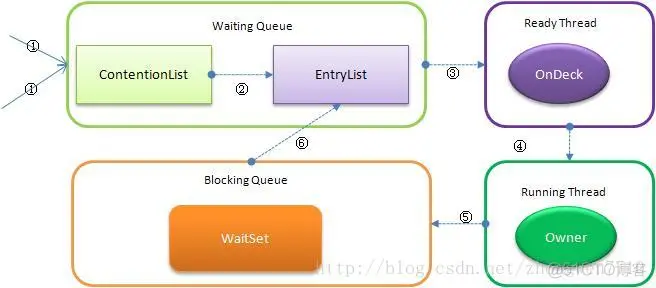

Java关键字synchronize理解

## 一：synchronize 与 static synchronized 的差别

​	synchronized: 是对类的当前实例进行加锁，防止其它线程同一时候访问该类的该实例的全部synchronized块（注意这里是“类的当前实例”，类的两个不同实例就没有这样的约束了）。
​	static synchronized: 恰好就是要控制类的全部实例的访问了，static synchronized是限制线程同一时候访问jvm中该类的全部实例同一时候访问相应的代码快。
​	实际上，在类中某方法或某代码块中有 synchronized，那么在生成一个该类实例后，该类也就有一个监视快，放置线程并发訪问该实例synchronized保护快。而static synchronized则是全部该类的实例公用一个监视快了。synchronized相当于this.synchronized,而staticsynchronized相当于Something.synchronized。

  	示例：假如有Something类的两个实例a与b，下列哪组方法可以被1个以上线程同一时候訪问
  	 pulbic class Something(){
  	     public synchronized void isSyncA(){}
  	     public synchronized void isSyncB(){}
  	     public static synchronizedvoid cSyncA(){}
  	     public static synchronizedvoid cSyncB(){}
  	 }
  	a. x.isSyncA()与 x.isSyncB()  		都是对同一个实例的synchronized域访问，因此不能被同一时候访问
  	b. x.isSyncA()与 y.isSyncA() 		是针对不同实例的，因此能够同一时候被访问
  	c. x.cSyncA()与 y.cSyncB()			由于是static synchronized，不同实例之间仍然会被限制，相当于Something.isSyncA()与 Something.isSyncB()，因此不能被同一时候访问
  	d. x.isSyncA()与 Something.cSyncA()	是能够被同一时候访问的，理由是synchronzied是实例方法 与 static synchronzied是类方法因此锁（lock）不同的原因
  	
  	结论：
  	A: static synchronized 是某个类的范围。static synchronized cSync{}防止多个线程同一时候访问这个类中的static synchronized方法，它能够对类的全部对象实例起作用。
  	B: synchronized 是某实例的范围。synchronized isSync(){}防止多个线程同一时候访问这个实例中的synchronized方法。

1、synchronized方法 与 synchronized代码快的差别
	synchronized methods(){} 与 synchronized（this）{}之间没有什么差别。仅仅是 synchronized methods(){} 便于阅读理解。而synchronized（this）{}能够更精确的控制冲突限制訪问区域，有时候表现更高效率。

2、synchronized keyword是不能继承的
	基类的方法synchronized f(){} 在继承类中并不自己主动是synchronized f(){}，而是变成了f(){}。
	继承类须要你显式的指定它的某个方法为synchronized方法。

## 二：JVM底层又是怎样实现synchronized的

​	在Java中存在两种锁机制：synchronized 和 Lock。
​	数据同步须要依赖锁，那锁的同步又依赖谁？synchronized给出的答案是在软件层面依赖JVM，而Lock给出的方案是在硬件层面依赖特殊的CPU指令。大家可能会进一步追问：JVM底层又是怎样实现synchronized的？

	synrhronized keyword简洁、清晰、语义明白，因此即有了Lock接口，其应用层的语义是能够把一个非null对象作为"锁"，当synchronized作用在方法上时。锁住的便是对象实例（this）；当作用在静态方法时锁住的便是对象相应的Class实例，由于Class数据存在于永久带，因此静态方法锁相当于该类的一个全局锁；当synchronized作用于某一个对象实例时，锁住的便是相应的代码块，在HotSpot JVM实现中，锁有个专门的名字：对象监视器。

1. 线程状态及状态转换
	当多个线程同一时候请求某个对象监视器时。对象监视器会设置几种状态用来区分请求的线程：
	ContentionList：全部请求锁的线程将被首先放置到该竞争队列
	EntryList：ContentionList中那些有资格成为候选人的线程被移到Entry List
	WaitSet：那些调用wait方法被堵塞的线程被放置到Wait Set
	OnDeck：不论什么时刻最多仅仅能有一个线程正在竞争锁，该线程称为OnDeck
	Owner：获得锁的线程称为Owner
	!Owner：释放锁的线程
	
	下图反映了这个状态转换关系：

