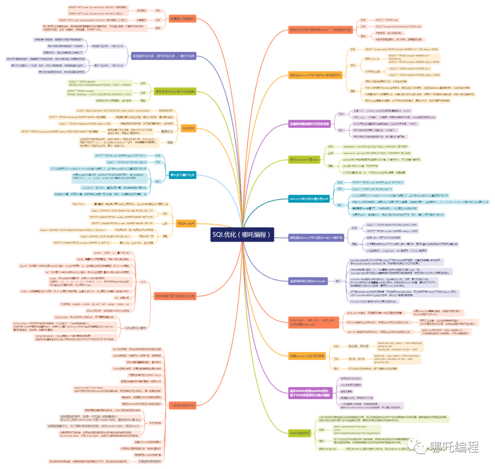

## 一、查询SQL尽量不要使用select \*，而是具体字段

1、反例

```
SELECT * FROM user
```

2、正例

```
SELECT id,username,tel FROM user
```

3、理由

1. 节省资源、减少网络开销。
2. 可能用到覆盖索引，减少回表，提高查询效率。


## 二、避免在where子句中使用 or 来连接条件

1、反例

```
SELECT * FROM user WHERE id=1 OR salary=5000
```

2、正例

（1）使用union all

```
SELECT * FROM user WHERE id=1 
UNION ALL
SELECT * FROM user WHERE salary=5000
```

（2）分开两条sql写

```
SELECT * FROM user WHERE id=1

SELECT * FROM user WHERE salary=5000
```

3、理由

1. 使用`or`可能会使索引失效，从而全表扫描；
2. 对于`or`没有索引的`salary`这种情况，假设它走了`id`的索引，但是走到`salary`查询条件时，它还得全表扫描；
3. 也就是说整个过程需要三步：全表扫描+索引扫描+合并。如果它一开始就走全表扫描，直接一遍扫描就搞定；
4. 虽然`mysql`是有优化器的，出于效率与成本考虑，遇到`or`条件，索引还是可能失效的；


## 三、尽量使用数值替代字符串类型

1、正例

1. 主键（id）：`primary key`优先使用数值类型`int`，`tinyint`
2. 性别（sex）：0代表女，1代表男；数据库没有布尔类型，`mysql`推荐使用`tinyint`

2、理由

1. 因为引擎在处理查询和连接时会逐个比较字符串中每一个字符；
2. 而对于数字型而言只需要比较一次就够了；
3. 字符会降低查询和连接的性能，并会增加存储开销；


## 四、使用varchar代替char

1、反例

```
`address` char(100) DEFAULT NULL COMMENT '地址'
```

2、正例

```
`address` varchar(100) DEFAULT NULL COMMENT '地址'
```

3、理由

1. `varchar`变长字段按数据内容实际长度存储，存储空间小，可以节省存储空间；
2. `char`按声明大小存储，不足补空格；
3.  其次对于查询来说，在一个相对较小的字段内搜索，效率更高；


## 五、技术延伸，char与varchar2的区别？

1、`char`的长度是固定的，而`varchar2`的长度是可以变化的。

比如，存储字符串`“101”`，对于`char(10)`，表示你存储的字符将占10个字节（包括7个空字符），在数据库中它是以空格占位的，而同样的`varchar2(10)`则只占用3个字节的长度，10只是最大值，当你存储的字符小于10时，按实际长度存储。

2、`char`的效率比`varchar2`的效率稍高。

3、何时用`char`，何时用`varchar2`?

`char`和`varchar2`是一对矛盾的统一体，两者是互补的关系，`varchar2`比`char`节省空间，在效率上比`char`会稍微差一点，既想获取效率，就必须牺牲一点空间，这就是我们在数据库设计上常说的“以空间换效率”。

`varchar2`虽然比`char`节省空间，但是假如一个`varchar2`列经常被修改，而且每次被修改的数据的长度不同，这会引起“行迁移”现象，而这造成多余的I/O，是数据库设计中要尽力避免的，这种情况下用`char`代替`varchar2`会更好一些。`char`中还会自动补齐空格，因为你`insert`到一个`char`字段自动补充了空格的,但是`select`后空格没有删除，因此`char`类型查询的时候一定要记得使用`trim`，这是写本文章的原因。

如果开发人员细化使用`rpad()`技巧将绑定变量转换为某种能与`char`字段相比较的类型（当然，与截断`trim`数据库列相比，填充绑定变量的做法更好一些，因为对列应用函数`trim`很容易导致无法使用该列上现有的索引），可能必须考虑到经过一段时间后列长度的变化。如果字段的大小有变化，应用就会受到影响，因为它必须修改字段宽度。

正是因为以上原因，定宽的存储空间可能导致表和相关索引比平常大出许多，还伴随着绑定变量问题，所以无论什么场合都要避免使用char类型。


## 六、where中使用默认值代替null

1、反例

```
SELECT * FROM user WHERE age IS NOT NULL
```

2、正例

```
SELECT * FROM user WHERE age>0
```

3、理由

1. 并不是说使用了`is null`或者 `is not null`就会不走索引了，这个跟`mysql`版本以及查询成本都有关；
2. 如果`mysql`优化器发现，走索引比不走索引成本还要高，就会放弃索引，这些条件 `!=，<>，is null，is not null`经常被认为让索引失效；
3. 其实是因为一般情况下，查询的成本高，优化器自动放弃索引的；
4. 如果把`null`值，换成默认值，很多时候让走索引成为可能，同时，表达意思也相对清晰一点；


## 七、避免在where子句中使用!=或<>操作符

1、反例

```
SELECT * FROM user WHERE salary!=5000

SELECT * FROM user WHERE salary<>5000
```

2、理由

1. 使用`!=`和`<>`很可能会让索引失效
2. 应尽量避免在`where`子句中使用`!=`或`<>`操作符，否则引擎将放弃使用索引而进行全表扫描
3. 实现业务优先，实在没办法，就只能使用，并不是不能使用


## 八、inner join 、left join、right join，优先使用inner join

三种连接如果结果相同，优先使用inner join，如果使用left join左边表尽量小。

- inner join 内连接，只保留两张表中完全匹配的结果集；
- left join 会返回左表所有的行，即使在右表中没有匹配的记录；
- right join 会返回右表所有的行，即使在左表中没有匹配的记录；

为什么？

- 如果inner join是等值连接，返回的行数比较少，所以性能相对会好一点；
- 使用了左连接，左边表数据结果尽量小，条件尽量放到左边处理，意味着返回的行数可能比较少；
- 这是mysql优化原则，就是小表驱动大表，小的数据集驱动大的数据集，从而让性能更优；


## 九、提高group by语句的效率

1、反例

先分组，再过滤

```
select job, avg（salary） from employee 
group by job
having job ='develop' or job = 'test';
```

2、正例

先过滤，后分组

```
select job，avg（salary） from employee 
where job ='develop' or job = 'test' 
group by job;
```

3、理由

可以在执行到该语句前，把不需要的记录过滤掉


## 十、清空表时优先使用truncate

`truncate table`在功能上与不带 `where`子句的 `delete`语句相同：二者均删除表中的全部行。但 `truncate table`比 `delete`速度快，且使用的系统和事务日志资源少。

`delete`语句每次删除一行，并在事务日志中为所删除的每行记录一项。`truncate table`通过释放存储表数据所用的数据页来删除数据，并且只在事务日志中记录页的释放。

`truncate table`删除表中的所有行，但表结构及其列、约束、索引等保持不变。新行标识所用的计数值重置为该列的种子。如果想保留标识计数值，请改用 DELETE。如果要删除表定义及其数据，请使用 `drop table`语句。

对于由 `foreign key`约束引用的表，不能使用 `truncate table`，而应使用不带  `where`子句的 DELETE 语句。由于 `truncate table`不记录在日志中，所以它不能激活触发器。

`truncate table`不能用于参与了索引视图的表。


## 十一、操作delete或者update语句，加个limit或者循环分批次删除

1、降低写错SQL的代价

清空表数据可不是小事情，一个手抖全没了，删库跑路？如果加limit，删错也只是丢失部分数据，可以通过binlog日志快速恢复的。

2、SQL效率很可能更高

SQL中加了`limit 1`，如果第一条就命中目标`return`， 没有`limit`的话，还会继续执行扫描表。

3、避免长事务

`delete`执行时,如果`age`加了索引，MySQL会将所有相关的行加写锁和间隙锁，所有执行相关行会被锁住，如果删除数量大，会直接影响相关业务无法使用。

4、数据量大的话，容易把CPU打满

如果你删除数据量很大时，不加 limit限制一下记录数，容易把`cpu`打满，导致越删越慢。

5、锁表

一次性删除太多数据，可能造成锁表，会有lock wait timeout exceed的错误，所以建议分批操作。


## 十二、UNION操作符

`UNION`在进行表链接后会筛选掉重复的记录，所以在表链接后会对所产生的结果集进行排序运算，删除重复的记录再返回结果。实际大部分应用中是不会产生重复的记录，最常见的是过程表与历史表`UNION`。如：

```
select username,tel from user
union
select departmentname from department
```

这个SQL在运行时先取出两个表的结果，再用排序空间进行排序删除重复的记录，最后返回结果集，如果表数据量大的话可能会导致用磁盘进行排序。推荐方案：采用`UNION ALL`操作符替代`UNION`，因为`UNION ALL`操作只是简单的将两个结果合并后就返回。


## 十三、批量插入性能提升

1、多条提交

```
INSERT INTO user (id,username) VALUES(1,'哪吒编程');

INSERT INTO user (id,username) VALUES(2,'妲己');
```

2、批量提交

```
INSERT INTO user (id,username) VALUES(1,'哪吒编程'),(2,'妲己');
```

3、理由

默认新增SQL有事务控制，导致每条都需要事务开启和事务提交，而批量处理是一次事务开启和提交，效率提升明显，达到一定量级，效果显著，平时看不出来。


## 十四、表连接不宜太多，索引不宜太多，一般5个以内

1、表连接不宜太多，一般5个以内

1. 关联的表个数越多，编译的时间和开销也就越大
2. 每次关联内存中都生成一个临时表
3. 应该把连接表拆开成较小的几个执行，可读性更高
4. 如果一定需要连接很多表才能得到数据，那么意味着这是个糟糕的设计了
5. 阿里规范中，建议多表联查三张表以下

2、索引不宜太多，一般5个以内

1. 索引并不是越多越好，虽其提高了查询的效率，但却会降低插入和更新的效率；
2. 索引可以理解为一个就是一张表，其可以存储数据，其数据就要占空间；
3. 索引表的数据是排序的，排序也是要花时间的；
4. `insert`或`update`时有可能会重建索引，如果数据量巨大，重建将进行记录的重新排序，所以建索引需要慎重考虑，视具体情况来定；
5. 一个表的索引数最好不要超过5个，若太多需要考虑一些索引是否有存在的必要；


## 十五、避免在索引列上使用内置函数

1、反例

```
SELECT * FROM user WHERE DATE_ADD(birthday,INTERVAL 7 DAY) >=NOW();
```

2、正例

```
SELECT * FROM user WHERE  birthday >= DATE_ADD(NOW(),INTERVAL 7 DAY);
```

3、理由

使用索引列上内置函数，索引失效。


## 十六、组合索引

排序时应按照组合索引中各列的顺序进行排序，即使索引中只有一个列是要排序的，否则排序性能会比较差。

```
create index IDX_USERNAME_TEL on user(deptid,position,createtime);
select username,tel from user where deptid= 1 and position = 'java开发' order by deptid,position,createtime desc; 
```

实际上只是查询出符合 `deptid= 1 and position = 'java开发'`条件的记录并按createtime降序排序，但写成order by createtime desc性能较差。


## 十七、复合索引最左特性

1、创建复合索引

```
ALTER TABLE employee ADD INDEX idx_name_salary (name,salary)
```

2、满足复合索引的最左特性，哪怕只是部分，复合索引生效

```
SELECT * FROM employee WHERE NAME='哪吒编程'
```

3、没有出现左边的字段，则不满足最左特性，索引失效

```
SELECT * FROM employee WHERE salary=5000
```

4、复合索引全使用，按左侧顺序出现 name,salary，索引生效

```
SELECT * FROM employee WHERE NAME='哪吒编程' AND salary=5000
```

5、虽然违背了最左特性，但MySQL执行SQL时会进行优化，底层进行颠倒优化

```
SELECT * FROM employee WHERE salary=5000 AND NAME='哪吒编程'
```

6、理由

复合索引也称为联合索引，当我们创建一个联合索引的时候，如(k1,k2,k3)，相当于创建了（k1）、(k1,k2)和(k1,k2,k3)三个索引，这就是最左匹配原则。

联合索引不满足最左原则，索引一般会失效。


## 十八、优化like语句

模糊查询，程序员最喜欢的就是使用`like`，但是`like`很可能让你的索引失效。

1、反例

```
select * from citys where name like '%大连' (不使用索引)
select * from citys where name like '%大连%' (不使用索引)
```

2、正例

```
select * from citys where name like '大连%' (使用索引) 。
```

3、理由

- 首先尽量避免模糊查询，如果必须使用，不采用全模糊查询，也应尽量采用右模糊查询， 即`like ‘…%’`，是会使用索引的；
- 左模糊`like ‘%...’`无法直接使用索引，但可以利用`reverse + function index`的形式，变化成 `like ‘…%’`；
- 全模糊查询是无法优化的，一定要使用的话建议使用搜索引擎。


## 十九、使用explain分析你SQL执行计划

1、type

1. system：表仅有一行，基本用不到；
2. const：表最多一行数据配合，主键查询时触发较多；
3. eq_ref：对于每个来自于前面的表的行组合，从该表中读取一行。这可能是最好的联接类型，除了const类型；
4. ref：对于每个来自于前面的表的行组合，所有有匹配索引值的行将从这张表中读取；
5. range：只检索给定范围的行，使用一个索引来选择行。当使用=、<>、>、>=、<、<=、IS NULL、<=>、BETWEEN或者IN操作符，用常量比较关键字列时，可以使用range；
6. index：该联接类型与ALL相同，除了只有索引树被扫描。这通常比ALL快，因为索引文件通常比数据文件小；
7. all：全表扫描；
8. 性能排名：system > const > eq_ref > ref > range > index > all。
9. 实际sql优化中，最后达到ref或range级别。

2、Extra常用关键字

- Using index：只从索引树中获取信息，而不需要回表查询；
- Using where：WHERE子句用于限制哪一个行匹配下一个表或发送到客户。除非你专门从表中索取或检查所有行，如果Extra值不为Using where并且表联接类型为ALL或index，查询可能会有一些错误。需要回表查询。
- Using temporary：mysql常建一个临时表来容纳结果，典型情况如查询包含可以按不同情况列出列的`GROUP BY`和`ORDER BY`子句时；


## 二十、一些其它优化方式

1、设计表的时候，所有表和字段都添加相应的注释。

2、SQL书写格式，关键字大小保持一致，使用缩进。

3、修改或删除重要数据前，要先备份。

4、很多时候用 exists 代替 in 是一个好的选择

5、where后面的字段，留意其数据类型的隐式转换。

未使用索引

```
SELECT * FROM user WHERE NAME=110
```

（1） 因为不加单引号时，是字符串跟数字的比较，它们类型不匹配； 

（2）MySQL会做隐式的类型转换，把它们转换为数值类型再做比较；

6、尽量把所有列定义为`NOT NULL`

`NOT NULL`列更节省空间，`NULL`列需要一个额外字节作为判断是否为 `NULL`的标志位。`NULL`列需要注意空指针问题，`NULL`列在计算和比较的时候，需要注意空指针问题。

7、伪删除设计

8、数据库和表的字符集尽量统一使用UTF8

（1）可以避免乱码问题；

（2）可以避免，不同字符集比较转换，导致的索引失效问题；

9、select count(*) from table；

这样不带任何条件的count会引起全表扫描，并且没有任何业务意义，是一定要杜绝的。

10、避免在where中对字段进行表达式操作

（1）SQL解析时，如果字段相关的是表达式就进行全表扫描 ；

（2）字段干净无表达式，索引生效；

11、关于临时表

（1）避免频繁创建和删除临时表，以减少系统表资源的消耗；

（2）在新建临时表时，如果一次性插入数据量很大，那么可以使用 select into 代替 create table，避免造成大量 log；

（3）如果数据量不大，为了缓和系统表的资源，应先create table，然后insert；

（4）如果使用到了临时表，在存储过程的最后务必将所有的临时表显式删除。先 truncate table ，然后 drop table ，这样可以避免系统表的较长时间锁定；

12、索引不适合建在有大量重复数据的字段上，比如性别，排序字段应创建索引

13、去重distinct过滤字段要少

1. 带distinct的语句占用`cpu`时间高于不带`distinct`的语句
2. 当查询很多字段时，如果使用`distinct`，数据库引擎就会对数据进行比较，过滤掉重复数据
3. 然而这个比较、过滤的过程会占用系统资源，如`cpu`时间

14、尽量避免大事务操作，提高系统并发能力

15、所有表必须使用`Innodb`存储引擎

`Innodb`「支持事务，支持行级锁，更好的恢复性」，高并发下性能更好，所以呢，没有特殊要求（即`Innodb`无法满足的功能如：列存储，存储空间数据等）的情况下，所有表必须使用`Innodb`存储引擎。

16、尽量避免使用游标

因为游标的效率较差，如果游标操作的数据超过1万行，那么就应该考虑改写。

