sda4

## 一.安装前知识及工具

### 1. ISO镜像文件

ISO是光盘的镜像文件，就是我们可以用ISO文件来刻录到光盘或者u盘中，进行安装系统。

```
ISO镜像官网（阿里云）:https://developer.aliyun.com/mirror/?spm=5176.10695662.1173276.1.52312a32O9lTs1
ISO镜像官网:https://mirrors.ustc.edu.cn/centos/7.9.2009/isos/x86_64/
ISO镜像官网（中国外国语大学镜像站）：https://mirrors.bfsu.edu.cn/centos/7.9.2009/isos/x86_64/
```

注意：记得下载完把.iso文件名改成Centos.iso，方便引导的时候引用。


## 二.安装Centos7

1.把U盘插到电脑上，设置开机U盘启动 ps：按F12或F2或F10可选择U盘，选择U盘后跳转到下图界面

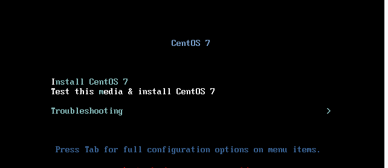 

2.按下键盘TAB键将最下面的vmlinuz initrd=initrd.img inst.stage2=hd:LABEL=CentOS\x207\x20x86_64 quiet 改为 **vmlinuz initrd=initrd.img linux dd quiet** 然后，按“F10”保存修改或ctrl+x进入到后续界面，然后就可以看到所有的盘了，找到LABEL中包含Cenots的磁盘，然后记住设备名称(我的是sda4)，执行reboot重启操作。

```
setparams 'Install CentOS Linux 7'
linuxefi /images/pxeboot/vmlinuz inst.stage2=hd:LABEL=CentOS\x207\x20x86_64 quiet
initrdefi /images/pxeboot/initrd.img
```

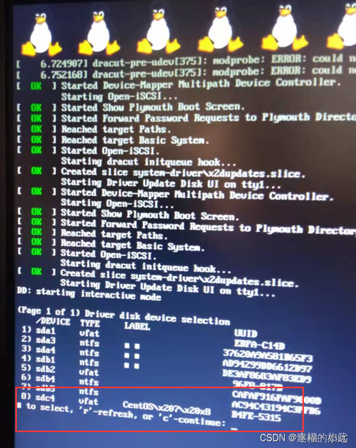

3.重启后到第三步界面按下TAB键，将vmlinuz initrd=initrd.img inst.stage2=hd:LABEL=CentOS\x207\x20x86_64 rd.live.check quiet 改为 vmlinuz initrd=initrd.img inst.stage2=hd:/dev/**sda4** quiet  ps：sda4就是你看到的启动盘名称

4.之后等待安装到图形界面，选择中文→English→点击继续(continue)

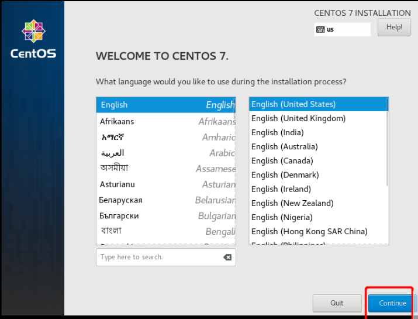

5.时间、键盘、语言、软件等选择，点击每一个图标即可进入某一项设置中；

set-timezone Asia/Shanghai （说明：在Linux系统中设置系统的时区为上海时区，北也就是中国标准时间（CST），通常称为北京时间（Beijing Time））


系统分盘：如果嫌麻烦就选择默认分区，分区之前把系统盘清空就行了（ 别把启动盘选中了）

如果手动分区看下面，自动分区略过；注意下图不要使用默认的LVM，而是改为Standard Partition，核对磁盘分区标准
磁盘分区为“Standard Partition”而非默认的LVM，此项非常重要，“Standard Partition”模式要比LVM模式快5倍左右：

!(assets/Window安装Linux系统/1215316-20170808141045183-1479677038.png)

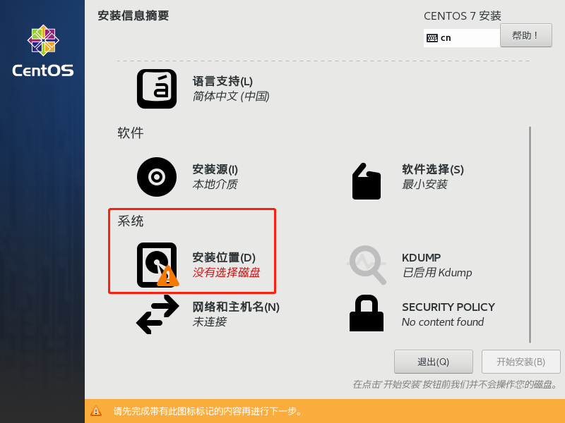


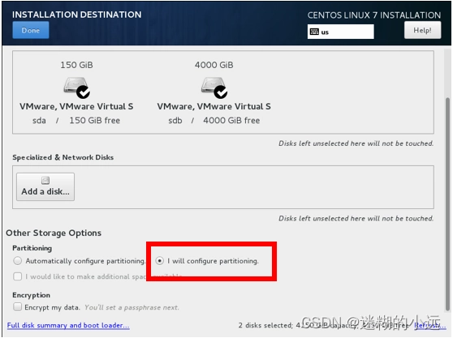

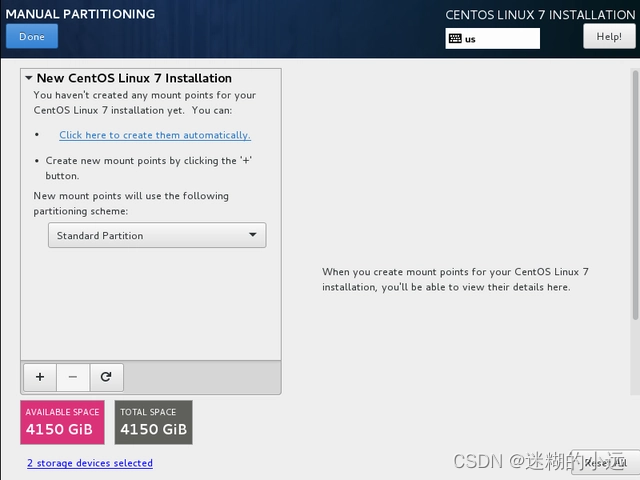

如果是以UEFI方式启动，会有多个boot分区，这几个boot分区保持默认不变即可

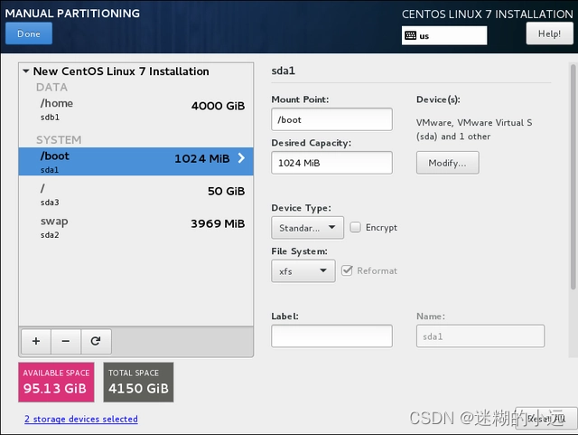

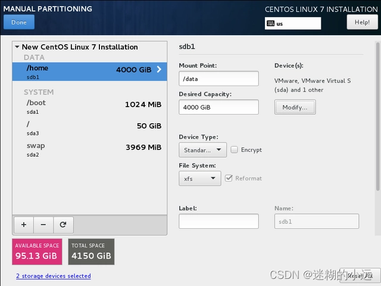

下面这一步分区很重要：
对于有两块或更多硬盘的机器，选择/home，将/home改为/data，后点击modify按钮，弹出的选择磁盘窗口一定要只选择一块最大的硬盘（或者RAID盘），然后把/data目录挂载到这个最大的硬盘（或者RAID盘）。
如果服务器只有一块硬盘，就删除/home或者/data挂载点。
对于150G或更小的系统盘，swap设置为16G；对于更大的系统盘，swap设置为32G。
最后把根目录/调整到最大，初swap外其他分区格式均为xfs，根目录要挂载到系统盘上（一般为ssd）。

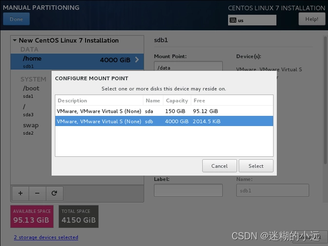

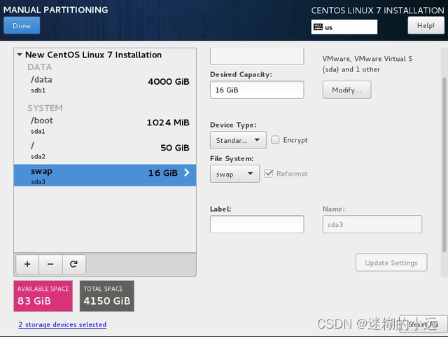

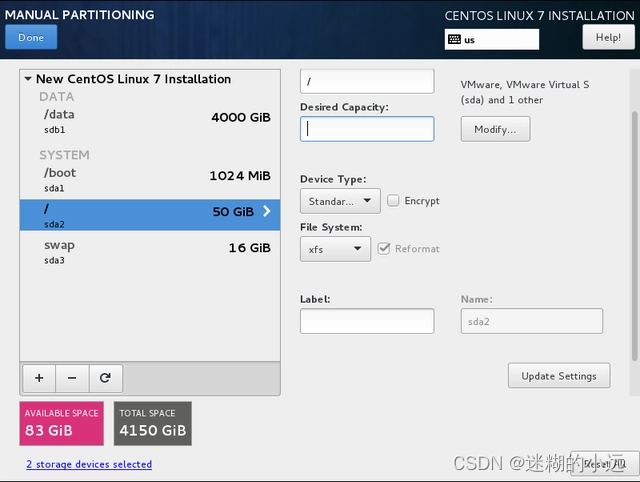

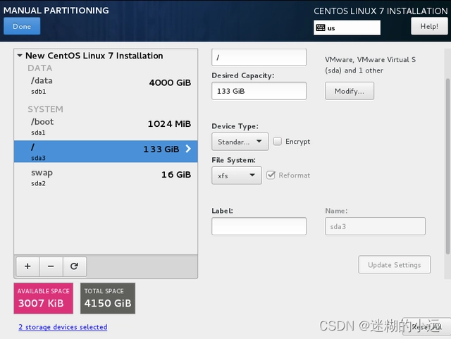

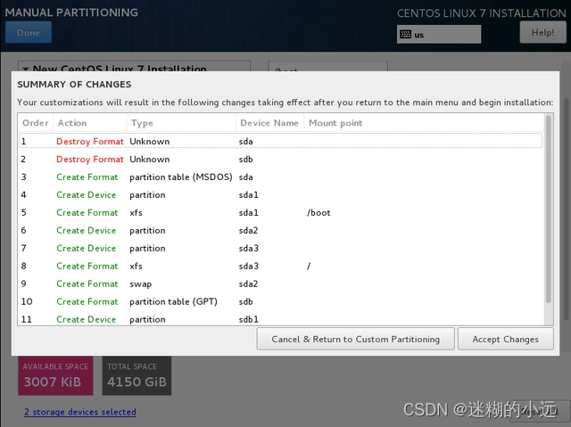

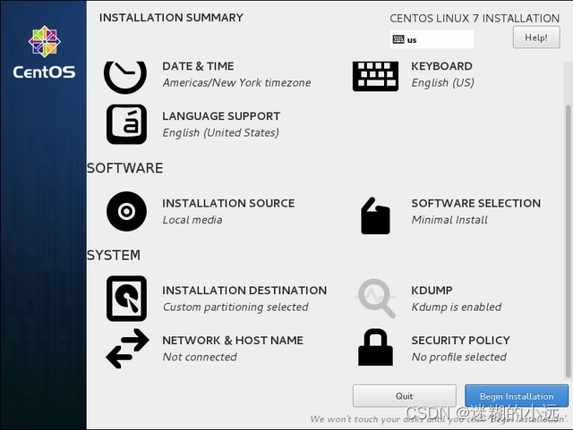


6.设置密码，可以先不设置用户。设置的密码要记得哦

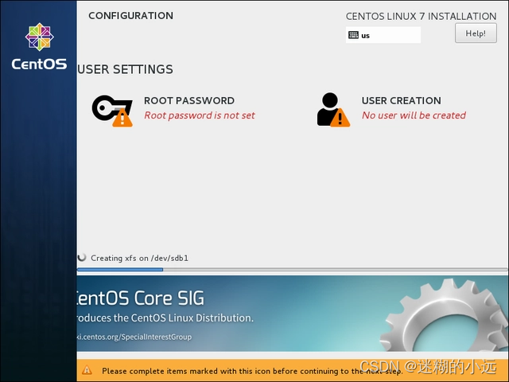

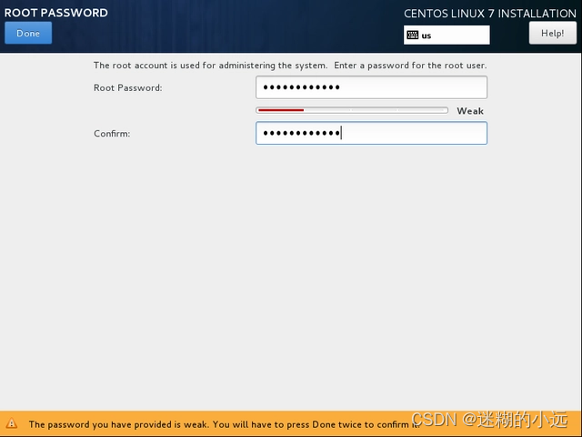

安装完成后重启

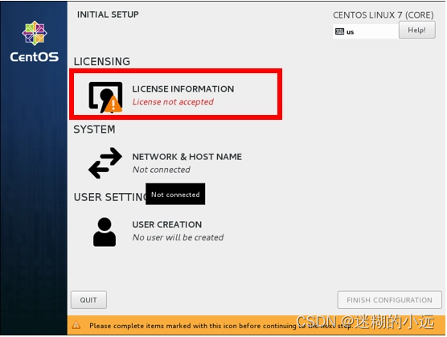

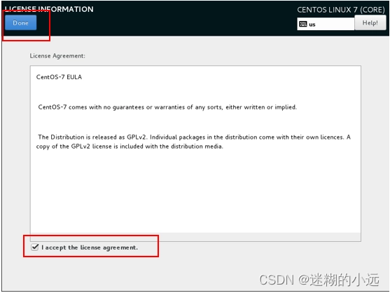

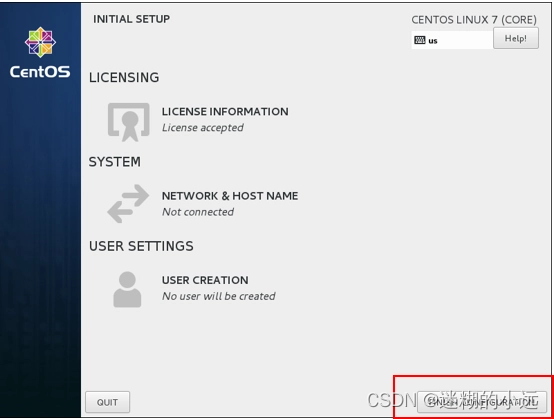