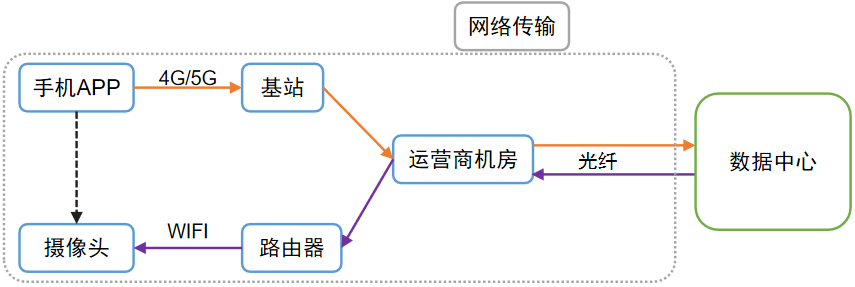
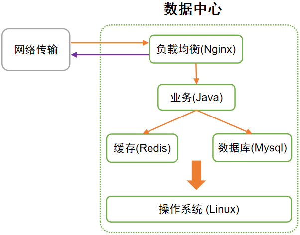
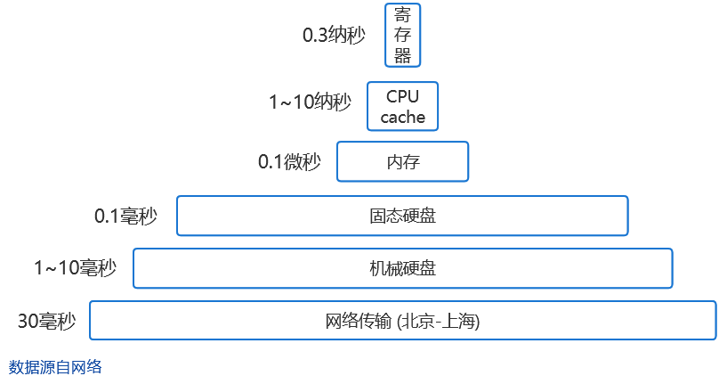
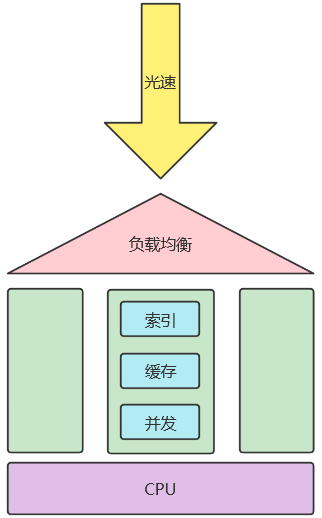
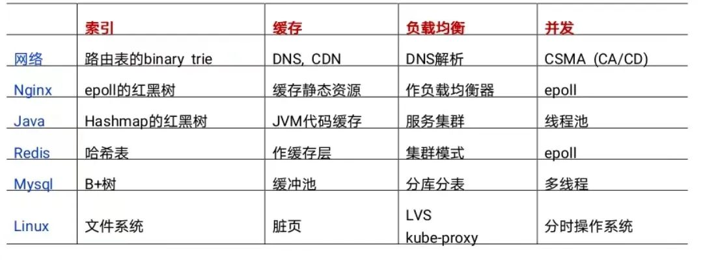

## **Labs 导读**

在这个互联网时代、智能家居时代，众多事物已实现信息化，无论是搜索还是发消息，几乎瞬间就能完成，方便又快捷。然而这一局面并非理所当然，其背后的体系精巧而又复杂，一旦出问题可能让人焦头烂额，却又无可奈何。本短文旨在快速科普，帮助读者了解这一体系高效运转的关键原因。

## **引言**

两百年前，人们想给远方的人传个话，需要十天半个月。互联网时代，我们只要按下回车，信息秒达，结果秒出。

问：那你可曾想过，信息传送为什么可以这么快？

答：你可能会说，信息以光速级别传输，不论是光纤还是4G/5G用的电磁波，那当然快了！

可是，仅仅是光速吗？那为什么原本扫码秒出结果的核酸系统，高峰时一个人可能卡十几分钟；为什么火车票抢着抢着系统就崩了？直觉告诉我们，因为用户多了，而系统应用的承载能力有限。因此，一个成熟的互联网应用面对海量用户，是练就了十八般武艺（优化策略）来巧妙应对。

其中有些策略的重要性堪比光速，有些也能在日常生活经验中找到影子。

## **整体流程**

在介绍优化策略前，有必要对网络信号的请求流程有个整体印象：

图1为通过APP控制摄像头“转头”的流程示意图，大致勾勒了一个信号（网络请求）的典型旅程。

图1 网络传输流程

简单来说，一个网络请求的耗时主要来自网络传输、数据中心处理。

具体来说，APP上点击按钮-->“转头”指令等信息，会被转化为0和1的二进制序列-->手机通过内置天线发射电磁波-->基站-->运营商机房-->通过光纤传送到千里之外的数据中心（图1）。

数据中心存放着系统的云端平台。平台处理后，将“转头”指令发出-->光纤传输-->到家中路由器，通过无线信号发给摄像头-->摄像头接收信号并转为0和1的序列-->还原为摄像头软件可理解的指令-->操控电机进行旋转。

图2 数据中心的平台组成

一眨眼的功夫，就完成了这么多环节（实际过程远比此复杂）。

从中可见，光速解决的仅仅是长距离传输的耗时问题，如果哪个节点卡住，效率直线下降，就如同短板木桶，盛水能力将大打折扣。

优化策略有很多，本文将介绍其中最为关键的4种：**索引，缓存，负载均衡，并发。**

## **优化策略**

### **3.1 索引**

索引可以说是非常伟大的发明了。用一句话说就是：事先分类排序，到时找起来方便。比如查字典，咱都是按索引查，如果没索引，从头找到尾可要累死个人。

数据中心里的数据库，几千万条数据也是司空见惯了。以mysql为例，用的索引方案一般是B+树，找一条数据1~4次即可找到，耗时约几十毫秒。而如果没有索引则需要遍历，可能十几秒才能找到，差距达数百倍。

相信大家用过windows自带的文件搜索，慢得令人无语；如果用everything等软件则瞬间出结果，正体现了索引的强大威力。（注：windows不是完全不用索引，是没用合适的索引）

当然索引并非全无代价：占存储空间；索引树时常变化，引起性能消耗。虽有代价，但非常值得，正所谓磨刀不误砍柴工嘛。

### **3.2 缓存**

为什么厨房的盐、味精要从调料盒里舀取，而不从包装袋里舀？因为从调料盒舀取方便、快。

为什么某东自营的快递那么快？全国各大仓库就近发货嘛。

以上便是计算机缓存的两种思路：把常用的数据拷贝到速度更快的地方，或离用户更近的地方，这样拿数据就快多了。

图3 计算机各类耗时

上图是计算机各部件单次访问的耗时，可见网络传输、硬盘的耗时是大头，所以这两者能免则免。

数据中心里，还是以数据库（Mysql）为例：它的全部数据存在硬盘上，但会将常用的热点数据拷到内存的缓冲池里，读写都在缓冲池，力求减免跟硬盘打交道而拖累整体效率。

这跟咱们写文档的情况是一样的：打开文档时文字被加载到电脑内存，新写的文字也记录到内存。

万一电脑或程序崩溃却没保存，那新写的可能就丢了，就是因为新写的还没来得及存到硬盘上呢（内存断电后数据会消失，而硬盘不会）。

数据库则无需担心，它有额外机制确保数据的改动不丢失，即预写式日志：每次操作在硬盘里简单记录下对硬盘的修改结果，这样即使没保存事后也能恢复。

打个不太恰当的比方，就像咱上课除了认真听还要好好做笔记，即使课后有的忘了，也能根据笔记想起来。

### **3.3 负载均衡**

俗话说得好：人多力量大。负载均衡就是以量取胜，通过增加节点来分摊压力。生活中，像食堂如果有很多窗口都能排队，是不是排队时间就短多了呢？

数据中心里，需要有负载均衡器（如Nginx）来起到对请求分流的作用，将请求转发到各后端节点。

面对流量高峰，后端节点的数量扩展如今挺方便，只要平台实现了容器化部署，加节点就是点几下按钮的事。

数据库也能负载均衡，即分库分表，将一张大表拆分成若干小表，分散到各机器上。正所谓船大难掉头，改成若干艘小船当然就轻松灵活了。

但分库分表不是点几下按钮就能解决的，它涉及到数据迁移、改代码、测试、上线。因此数据库的扩容，需要未雨绸缪，早做谋划；否则流量高峰期系统可能被冲垮，这样所有人都用不了了。

### **3.4 并发**

虽说人多力量大，但个体太弱也不行。如何让个体变强，即如何提升单台服务器的性能呢？

并发是一种思路。如今的计算机可以同时放歌、聊微信、下载视频，似乎这对于万能的计算机是理所当然的。

然而，早期的计算机，同一时间只能运行一个软件、给一个用户用，相当不方便。

后来分时操作系统解决了这个问题，原理是将CPU的时间分成一片片（几十到几百毫秒），轮流分给不同的软件使用（此处指单核CPU）。这体现了并发的思想：若干事件微观上先后轮流进行，但宏观表现为同时进行。

你可能想，这不是骗人吗，而且每个软件的效率会明显降低吧？

其实，一个软件（或进程）不是一直占着CPU，很多时候是在休息（即阻塞），比如读写硬盘，等待网络请求的回应。此时CPU闲着也是闲着，拱手让给其他软件用岂不美哉。

就如泡茶问题：等水烧开期间去洗茶杯、放茶叶才是明智之举，而不是等水烧开了再干活。

因此，操作系统的这种时间分片轮流使用的策略，一方面充分利用了CPU；另一方面，即使是一个真的连续干活的任务拆解为若干次分散执行，多数情况下人宏观上也感知不到微观层面的这种卡顿。

### **3.5 CPU**

最后补谈一个重要因素：CPU。

你可能听说过现在的软件可复杂了，动不动几十万行代码。实际上一次网络请求涉及的代码也是不计其数，而这一切在短短几（十）毫秒内就能完成，已经不是人的思维能跟得上的了。

这实际上离不开CPU的高性能。如今常见CPU一秒可以执行几十亿次指令，而它诞生之初只能几十万次。如果没有CPU的高速，互联网精巧而庞杂的体系也无从谈起了。

比如你盯着屏幕的这一刻，无论手机还是电脑，幕后英雄CPU正以我们无法想象的风驰电掣在干各种活。

当然，也不是CPU频率越高就意味着软件的性能越好，影响因素有很多，因此相信国产CPU后来居上也是有希望的。

## **结语**

用一个简图（图4）概括本文：光速是“瞬时”传输的必要条件；如果用户多处理不过来，那就通过负载均衡增加节点；每个节点都能利用索引、缓存、并发来大幅提升性能；而CPU，又是链路上所有节点能够快速处理的基础。

图4 网络请求的优化策略

网络请求的优化策略远不止上文提到的，还有IO多路复用、池化、批量处理、削峰填谷等等，都不容小觑。

本文提到的网络链路上各环节的优化策略的举例，汇总如下表：

表1 网络请求链路上各环节的优化策略举例

