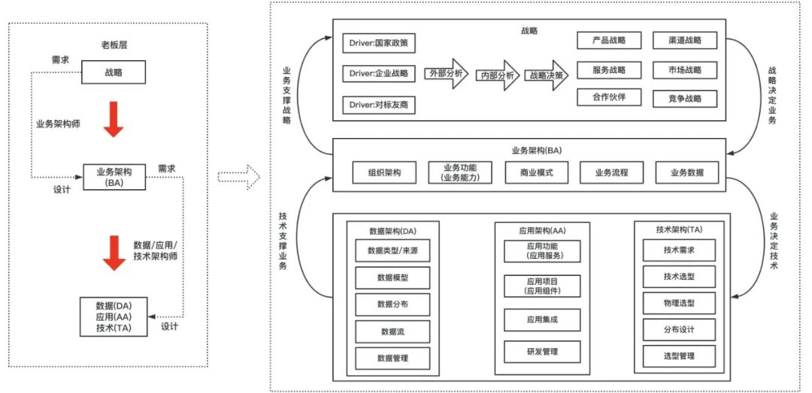
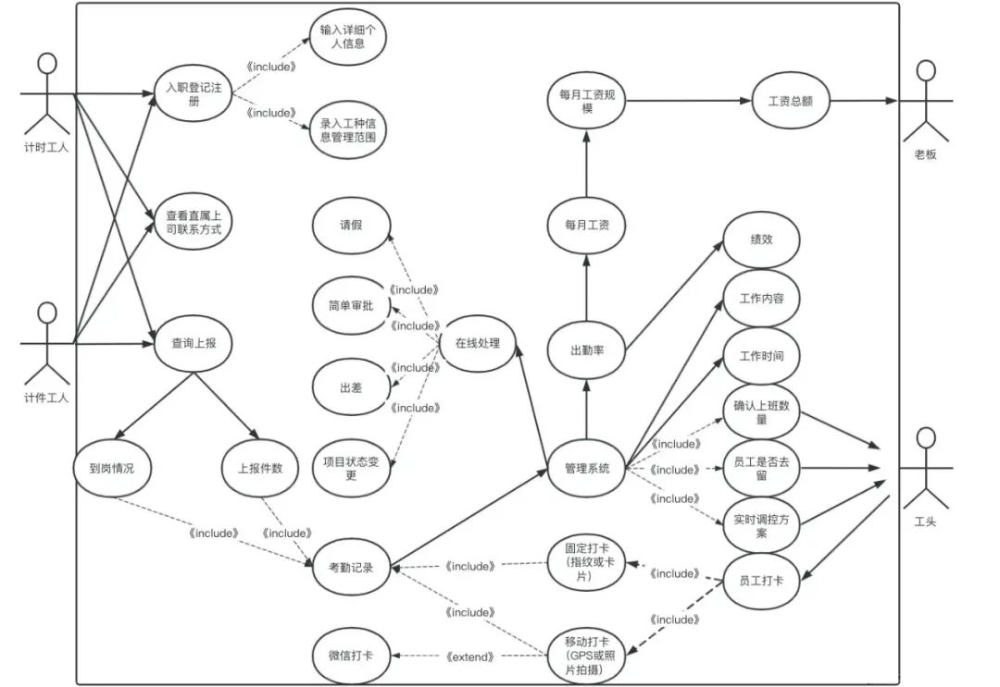
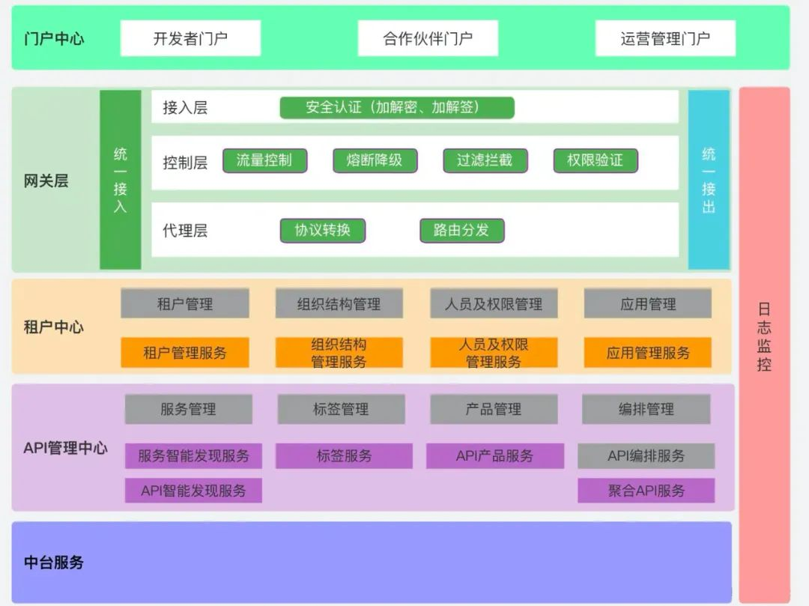
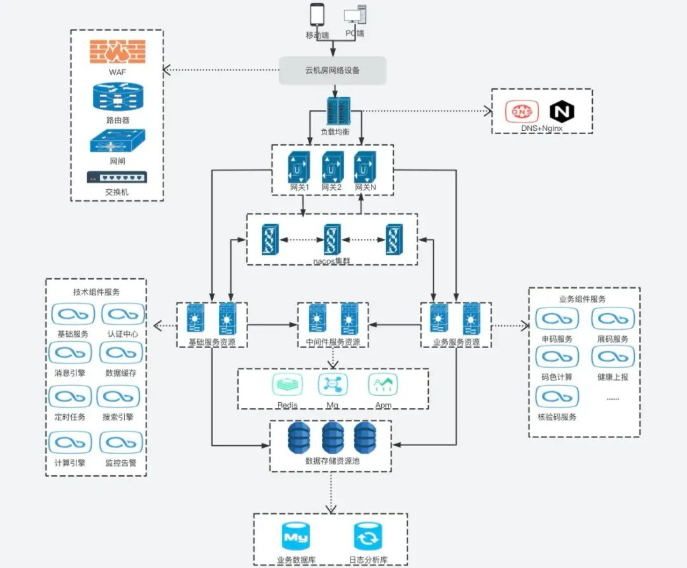
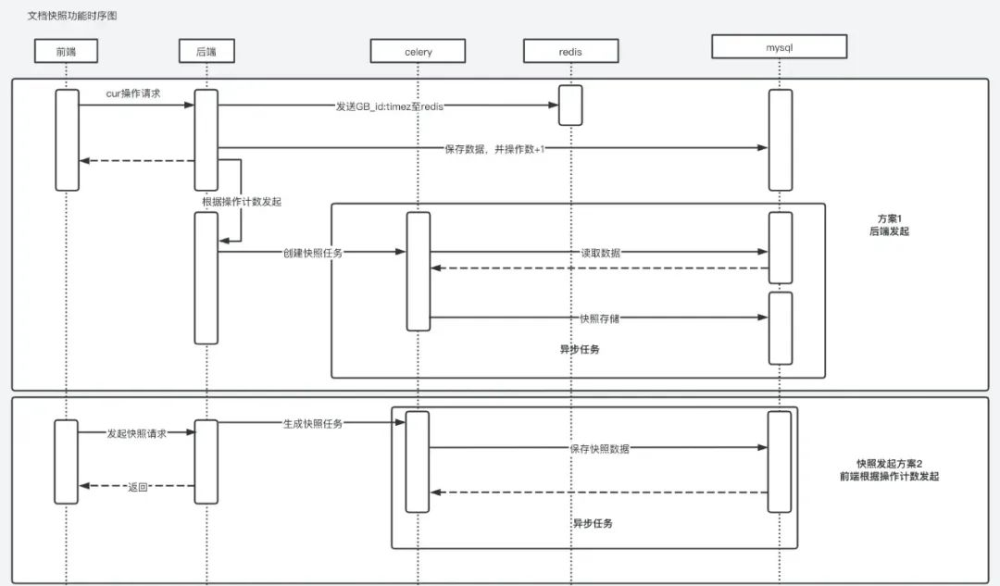
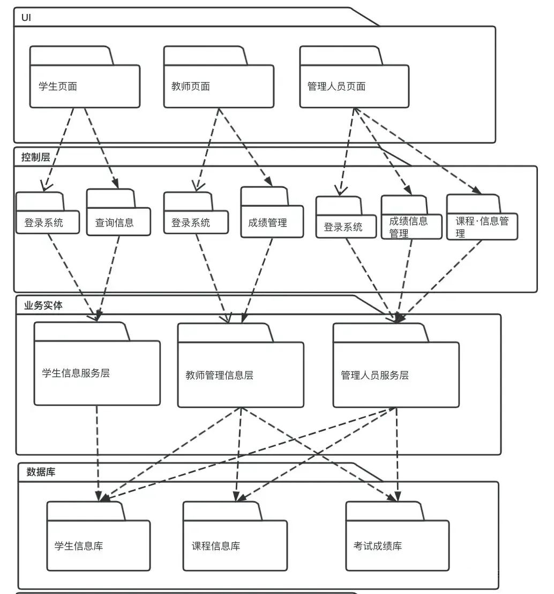
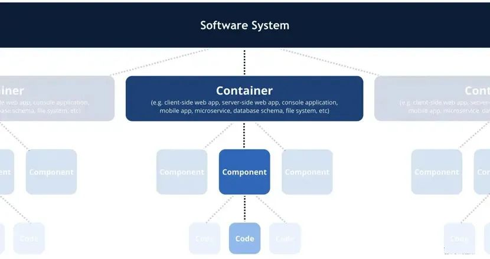
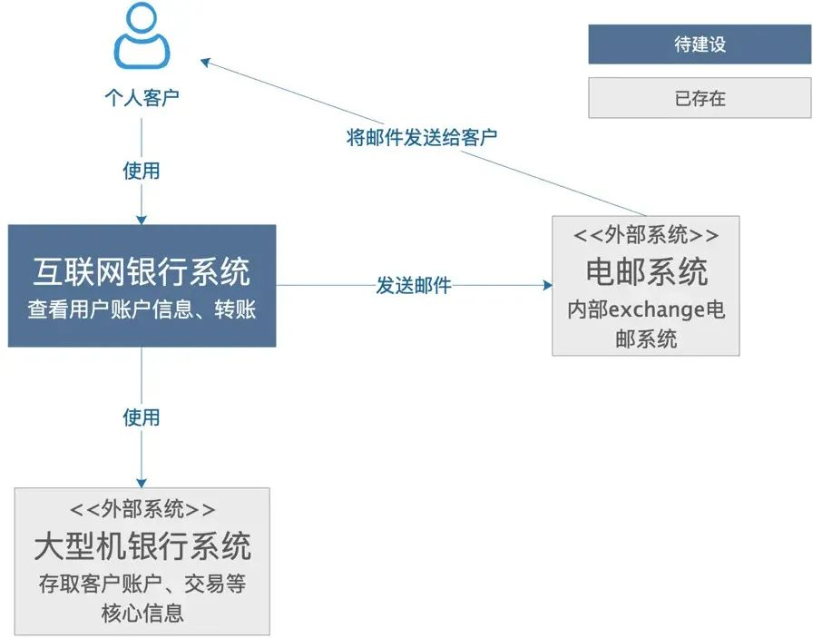
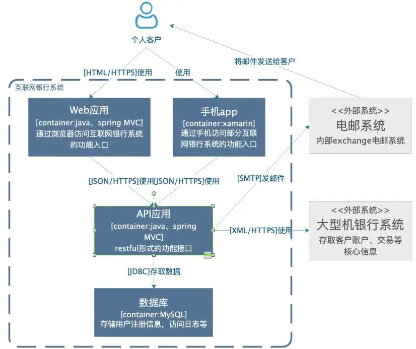
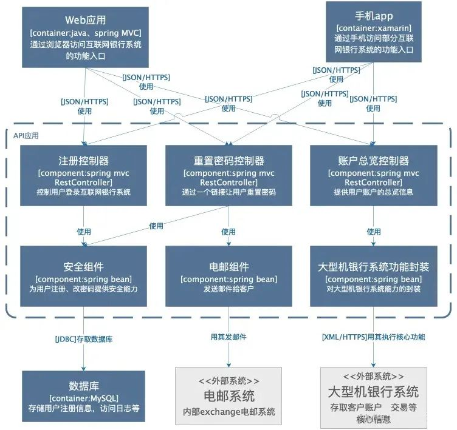

## **架构的定义**

- 系统架构是概念的体现，是对物/信息的功能与形式元素之间的对应情况所做的分配，是对元素之间的关系以及元素同周边环境之间的关系所做的定义；
- 架构就是对系统中的实体以及实体之间的关系所进行的抽象描述，是一系列的决策；
- 架构是结构和愿景。

在TOGAF企业架构理论中， 架构是从公司战略层面，自顶向下的细化的一部分，从战略=> 业务架构=>应用/数据/技术架构，Boss层关注的是战略与业务架构，技术层的需要聚焦到应用/数据/技术架构这一层。

- 业务架构：由业务架构师负责，也可以称为业务领域专家、行业专家，业务架构属于顶层设计，其对业务的定义和划分会影响组织架构和技术架构。
- 应用架构：由应用架构师负责，需要根据业务场景需要，设计应用的层次结构，制定应用规范、定义接口和数据交互协议等。并尽量将应用的复杂度控制在一个可以接受的水平，从而在快速的支撑业务发展的同时，在保证系统的可用性和可维护性的同时，确保应用满足非功能属性的要求如性能、安全、稳定性等。
- 技术架构：描述了需要哪些服务；选择哪些技术组件来实现技术服务；技术服务以及组件之间的交互关系。
- 数据架构：描述了数据模型、分布、数据的流向、数据的生命周期、数据的管理等关系。

## **架构图的分类**

***系统架构图是为了抽象的表示软件系统的整体轮廓和各个组件之间的相互关系和约束边界，以及软件系统的物理部署和软件系统的演进方向的整体视图***。好的架构图可以让干系人理解、遵循架构决策，就需要把架构信息传递出去。那么，画架构图是为了：解决沟通障碍/达成共识/减少歧义。比较流行的是4+1视图和C4视图。

### **4+1视图**

#### 1、场景视图

用于描述系统的参与者与功能用例间的关系，反映系统的最终需求和交互设计，通常由用例图表示。

#### 2、逻辑视图

用于描述系统软件功能拆解后的组件关系，组件约束和边界，反映系统整体组成与系统如何构建的过程，通常由UML的组件图和类图来表示。

#### 3、物理视图

用于描述系统软件到物理硬件的映射关系，反映出系统的组件是如何部署到一组可计算机器节点上，用于指导软件系统的部署实施过程。

#### 4、处理流程视图

用于描述系统软件组件之间的通信时序，数据的输入输出，反映系统的功能流程与数据流程，通常由时序图和流程图表示。

#### 5、开发视图

开发视图用于描述系统的模块划分和组成，以及细化到内部包的组成设计，服务于开发人员，反映系统开发实施过程。

5种架构视图从不同角度表示一个软件系统的不同特征，组合到一起作为架构蓝图描述系统架构。

### **C4视图**

下面的案例来自C4官网，然后加上了一些笔者的理解。

C4模型使用容器（应用程序、数据存储、微服务等）、组件和代码来描述一个软件系统的静态结构。这几种图比较容易画，也给出了画图要点，但最关键的是，我们认为，它明确指出了每种图可能的受众以及意义。

#### 1、语境图（System Context Diagram）

用于描述要我们要构建的系统是什么，用户是谁，需要如何融入已有的IT环境。这个图的受众可以是开发团队的内部人员、外部的技术或非技术人员。

#### 2、容器图（Container Diagram）

容器图是把语境图里待建设的系统做了一个展开描述，主要受众是团队内部或外部的开发人员或运维人员，主要用来描述软件系统的整体形态，体现了高层次的技术决策与选型，系统中的职责是如何分布的，容器间是如何交互的。

#### 3、组件图（Component Diagram）

组件图是把某个容器进行展开，描述其内部的模块，主要是给内部开发人员看的，怎么去做代码的组织和构建，描述了系统由哪些组件/服务组成，了组件之间的关系和依赖，为软件开发如何分解交付提供了框架。

## **如何画好架构图**

### **视图的受众**

在画出一个好的架构图之前， 首先应该要明确其受众，再想清楚要给他们传递什么信息，所以，不要为了画一个物理视图去画物理视图，为了画一个逻辑视图去画逻辑视图，而应该根据受众的不同，传递的信息的不同，用图准确地表达出来，最后的图可能就是在这样一些分类里。那么，画出的图好不好的一个直接标准就是：受众有没有准确接收到想传递的信息。

### **视图的元素区分**

可以看到架构视图是由方框和线条等元素构成，要利用形状、颜色、线条变化等区分元素的含义，避免混淆。架构是一项复杂的工作，只使用单个图表来表示架构很容易造成莫名其妙的语义混乱。