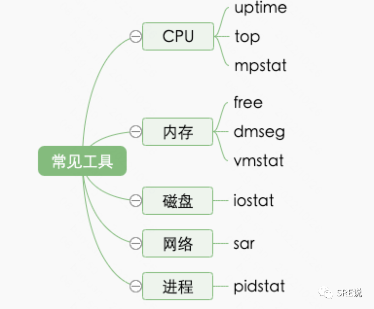

## 第一问：进程和线程

本质：进程和线程的区别就像房子跟房间的关系和区别。

**房子和房间**

  房子和房间的区别，无论房子还是房间最根本的目的是住人； 无论进程还是线程，最根本的目的是处理事情。 

  进程是操作系统资源分配（内存，显卡，磁盘）的最小单位，线程是执行调度（即cpu调度）的最小单位（cpu看到的都是线程而不是进程）。

  如何记忆进程和线程？在疫情期间，物业发放资源，是按照房子来发放的，肯定不是按照房间来发放，这个也就是资源分配。调度是什么，当然如果你一个包租婆肯定单租利益最大化，那就是按照房间来进行。 

**优点和缺点**

  进程的优势在于什么呢？ 稳定，多进程不会 有影响；缺点是不灵活，使用成本高。

  线程的优势在于？灵活，使用成本低；缺点在于不稳定，一个线程可能会阻塞其他的线程正常进行。

  对于房间和房子的区别是不是好理解了。房子的隔离性好；而房间比较灵活，好出租。 

**如何选择**

  nginx用的是多进程而不是多线程。原因是什么？nginx是用的多进程的方式，目的就是为了稳定。如何你的程序对稳定性要求特别高就需要使用多进程了，nginx作为流量入口，必然要求非常高的稳定性。

  日常的程序一般是多线程，因为部署在了多台机器上，实现了分布式的管理。就算挂一个实例，影响其实是可控的。

**面试考察点**

  稳定和灵活之前需要兼容，一般都是多线程，如果是一个更稳定的要求就需要多进程，反过来来再看这个表格是不是就好理解了。对应到房子跟房间的关系和区别：

|          | 进程                                                         | 线程                                                         |
| -------- | ------------------------------------------------------------ | ------------------------------------------------------------ |
| 资源分配 | 是系统进行资源分配和调度的基本单位                           | 继承和共享进程的资源，不能单独的分配                         |
| 调度方式 | 子进程与父进程平等竞争                                       | 子线程与父线程平等竞争                                       |
| 通信方式 | A.共享内存  B.消息队列  C.信号量  D.有名管道  E.无名管道  F.信号 G.文件 H.socket | A.互斥量   B.自旋锁   C.条件变量 D.读写锁   E.线程信号 G.全局变量 |
|          | 进程间采用的通信方式要么需要**切换内核上下文**，所以速度会比较慢。 | 基本都在自己的进程空间内完成，不存在切换，所以通信速度会较快。 |
| 稳定性   | 进程之间资源和空间相对独立，所有一个进程挂了不会影响到其他的进展，稳定性要好，比如nginx采用的就是多进程的模式 | 线程资源共享资源，一个线程如果对公共资源有影响，比如越栈，溢出，core等就会对其他线程产生影响。 |
| 实现     | 复杂                                                         | 简单                                                         |

## 第二问：idle和load

含义：idle利用率， load负载。

**CPU中IDLE和load的区别**

- CPU的利用率就是指非空闲进程占用时间的比例，即CPU执行非空闲进程的时间 / CPU总的执行时间。
- 平均负载是指单位时间内，系统处于可运行状态和不可中断状态的平均进程数，也就是平均活跃进程数。

举个例子：

- 比如银行10个普通通道，有100个人取号排队，这个时候负载就是100/10=10；idle，为1个小时之内平均工作时间，10人都在工作idle=100%
- 特殊情况：比如银行有9个vip通道，1个普通通道，这个普通通道有100个人，而剩余9个vip通道没有人，这个时候负载就是100/10=10；idle为1个小时之内平均工作时间，1人工作9人空闲，idle=10%

**是不是大家越平均越好呢**

- 如果是普遍来看当然是的
- 但是有些特殊场景，比如是一些大客户那就需要有更好的体验，就算窗口没人也不能提供出去，必须保障大客户一到马上处理。

**计算机内有没有这种场景的呢**

  答案是有的，最近云原生的崛起，cgroup越来越广泛，如果对某个进程做了CPU隔离，那么这个进程所有的资源就会被限制。所以就会看到当前负载很高，但是idle确很闲。

  就好比银行里面要办里面一个非常保密的业务，单独开了一个窗口，但是人很多。你看到一个窗口的人非常多，而别的窗口却没人。

**最后**

  判断一个服务器CPU的情况，负载和利用率同时都看一下，如果都高，那说明就CPU的使用就比较高了。

## 第三问：异步和同步，阻塞和非阻塞

**同步阻塞方式**：发送方发送请求之后一直等待响应。接收方处理请求时进行的IO操作如果不能马上等到返回结果，就一直等到返回结果后，才响应发送方，期间不能进行其他工作。

**同步非阻塞方式**：发送方发送请求之后，一直等待响应。接受方处理请求时进行的IO操作如果不能马上的得到结果，就立即返回，去做其他事情。但是由于没有得到请求处理结果，不响应发送方，发送方一直等待。当IO操作完成以后，将完成状态和结果通知接收方，接收方再响应发送方，发送方才进入下一次请求过程。（实际不应用）

**异步阻塞方式：**发送方向接收方请求后，不等待响应，可以继续其他工作。接收方处理请求时进行IO操作如果不能马上得到结果，就一直等到返回结果后，才响应发送方，期间不能进行其他操作。（实际不应用）

**异步非阻塞方式：**发送方向接收方请求后，不等待响应，可以继续其他工作。接收方处理请求时进行IO操作如果不能马上得到结果，也不等待，而是马上返回去做其他事情。当IO操作完成以后，将完成状态和结果通知接收方，接收方再响应发送方。（效率最高）

**正常解释**

同步与异步是对应于调用者与被调用者，它们是线程之间的关系，两个线程之间要么是同步的，要么是异步的

- 同步操作时，调用者需要等待被调用者返回结果，才会进行下一步操作
- 而异步则相反，调用者不需要等待被调用者返回结果，即可进行下一步操作，被调用者通常依靠事件、回调等机制来通知调用者结果

阻塞与非阻塞是对同一个线程来说的，在某个时刻，线程要么处于阻塞，要么处于非阻塞

- 阻塞和非阻塞关注的是程序在等待调用结果（消息，返回值）时的状态：
- 阻塞调用是指调用结果返回之前，当前线程会被挂起。调用线程只有在得到结果之后才会返回。
- 非阻塞调用指在不能立刻得到结果之前，该调用不会阻塞当前线程。

## 第四问：软中断和硬中断

**什么中断**

举个生活中的例子，你正在coding爽的时候，有人给你打电话。这个时候中断就产生了。如果没有中断的话，别人只能等你空闲的时候打电话，而别人也不知道你什么时候有空只能等着，反复的重试。

**什么是软中断，什么是硬中断呢？**

日常生活中可以理解为，没法延迟处理的必须停下来做的事情硬中断，可以延迟处理是有一定的灵活控制的为软中断。

软中断和硬中断的区别，可以理解为接电话和清单本的区别一样。接电话是什么，一旦有电话来了看看是个什么事情，如果电话能讲清楚的电话解决，如果电话解决不了就记录到本子上，然后按照时间和优先级逐个解决。

计算机为什么要这么设计的呢，其实也就是跟人一样的，为了提升工作效率，如果一个事情非常难搞，而你非要在电话讲清楚是不是就浪费太多的时间了，你电话期间可能耽误别的事情。所以先记录下来，慢慢处理。

**举个网卡的例子**

网卡接收到数据包后，会通过硬件中断的方式，通知内核有新的数据到了。这时，内核就应该调用中断处理程序来响应它。你可以自己先想一下。

对上半部来说，既然是快速处理，其实就是要把网卡的数据读到内存中，然后更新一下硬件寄存器的状态（表示数据已经读好了），最后再发送一个软中断信号，通知下半部做进一步的处理。而下半部被软中断信号唤醒后，需要从内存中找到网络数据，再按照网络协议栈，对数据进行逐层解析和处理，直到把它送给应用程序。

看如下图，网卡首先会把数据放到RingBuffer里面，然后通知内核。这个有个问题，tcp的三次握手是在哪里完成的呢？ 

  

**怎么看出中断呢**

/proc/softirqs 提供了软中断的运行情况；

/proc/interrupts 提供了硬中断的运行情况。

另外关于下半部中的包括了softirq、tasklet、workqueue、以及前文中提到过的中断线程化处理等，其中tasklet又是基于softirq来实现的，这个可以理解为记事本里面各种类型的事情用不同的颜色来标记，比如中午约的饭，下午的工作的deadline等等。

硬中断有哪些呢？ 比如鼠标、键盘、网卡等等都可以产生硬件中断。因为CPU并不知道外部硬件设备何时产生硬件中断请求，不会提前获知产生硬件中断的前提。

## 第五问：CFS调度算法

**CFS算法**

CPU调度算法其实就是解决两个问题 第一是时间，第二是优先级。

cfs定义了一种新的模型，它给cfs_rq（cfs的run queue）中的每一个进程安排一个虚拟时钟，vruntime。如果一个进程得以执行，随着时间的增长（也就是一个个tick的到来），其vruntime将不断增大。没有得到执行的进程vruntime不变而调度器总是选择vruntime跑得最慢的那个进程来执行。这就是所谓的“完全公平”。为了区别不同优先级的进程，优先级高的进程vruntime增长得慢，以至于它可能得到更多的运行机会。

vruntime += 实际运行时间（time process run) * 1024 / 进程权重(load weight of this process) 

这里可以看到权重越高，虚拟时间就越少。虚拟时间越少，说明碗越低，约有可能得到饭。 

**红黑数**

红黑树是干嘛的，一提到CFS算法大家就直接提到红黑树。其实这里大家不用关心红黑树的原理，只不过是把各个线程的组织起来，也就说把和尚的碗拍排列好。方便老和尚快速发现应该给谁，如果排列不好，那么老和尚就所有的时间就话在找碗上面去了。所以需要一个方式快速组织起来

## 第六问：用户态和内核态

**手术室和普通门诊**

  我们去过医院吧，是不是被手术室的一道重重的的铁门隔离在外面。

  就算你是一个大夫只有做手术的时候才能进去，因为手术室的资源是有限的，并且是最核心的医院资源。

**
**

**用户态和内核态**

  Linux的架构中，很重要的一个能力就是操纵系统资源的能力。但是，系统资源是有限的，如果不加限制的允许任何程序以任何方式去操纵系统资源，必然会造成资源的浪费，发生资源不足等情况。为了减少这种情况的发生，Linux制定了一个等级制定，即特权。Linux将特权分成两个层次，以0和3标识。0的特权级要高于3。换句话说，0特权级在操纵系统资源上是没有任何限制的，可以执行任何操作，而3，则会受到极大的限制。我们把特权级0称之为内核态，特权级3称之为用户态。

  一个应用程序，在执行的过程中，会在用户态和内核态之间根据需要不断切换的。因为，如果只有用户态，那么必然有某些操纵系统资源的操作很难完成或不能完成，而如果一直都在内核态，那事实上，导致特权的分层失去了意义。大家全是最高权限，和大家都没有限制，没有什么区别。

  所以，应用程序一般会运行于用户态，会在需要的时候，切换成内核态，完成相关任务后，会再切换加用户态。需要注意的是，一种切换是有一定系统开销的。

**一个医生什么时候去手术室呢？**

  **第一个系统调用，**正常的排号到医生了手术日期了，这个也就是系统调用，手术室通知，大夫下午是你的手术。

  **这是用户态进程主动要求切换到内核态的一种方式**，**用户态进程通过系统调用申请使用操作系统提供的服务程序完成工作。**比如前例中fork()实际上就是执行了一个创建新进程的系统调用。而系统调用的机制其核心还是使用了操作系统为用户特别开放的一个中断来实现，例如Linux的int 80h中断。

用户程序通常调用库函数，由库函数再调用系统调用，因此有的库函数会使用户程序进入内核态（只要库函数中某处调用了系统调用），有的则不会。

  **第二个是异常，**比如你正在给病人在门诊看病，突然口吐白沫，那就是异常了就需要赶紧手术了

  当CPU在执行运行在用户态下的程序时，发生了某些事先不可知的异常，这时会触发由当前运行进程切换到处理此异常的内核相关程序中，也就转到了内核态，比如缺页异常。

  **第三个中断，**比如你正在看病，发现有别的大夫找你马上来趟手术室。**当外围设备完成用户请求的操作后，会向CPU发出相应的中断信号**，这时CPU会暂停执行下一条即将要执行的指令转而去执行与中断信号对应的处理程序，

  如果先前执行的指令是用户态下的程序，那么这个转换的过程自然也就发生了由用户态到内核态的切换。比如硬盘读写操作完成，系统会切换到硬盘读写的中断处理程序中执行后续操作等。

## 第七问：进程上下文切换什么时候发生

**进程上下文是最常见的一个问题，如何去记忆呢。** 

  **官方解释：**进程上下文是进程执行活动全过程的静态描述。我们把已执行过的进程指令和数据在相关寄存器与堆栈中的内容称为进程上文，把正在执行的指令和数据在寄存器与堆栈中的内容称为进程正文，把待执行的指令和数据在寄存器与堆栈中的内容称为进程下文。

  **场景联想：****这里可以对应到大夫看病，**需要把病人资料存储到医院电脑里面。存哪些数据呢，病人的基本进行，比如姓名、性别、年龄等；病人的病情分析，比如家族史等等。

   大夫如果要切换病人的时候应该怎么办呢，是不是把病历本，检查单子都整理好，收起来，然后下次病人来的时候快速快速拿出来。从电脑里面先把病人材料拿出来

**什么时候发生进程上下文切换呢**

**大夫在出门诊的时候，什么时候会从一个病人切换到下一个病人呢？**

  第一种是时间片用完：一个病人病特别复杂，而且病人问题特别多，发现时间特别长，大夫就会说，你先等下，如果今天上午给一个病人看的话剩余病人就没法看了，肯定先了解一下，给病人重新挂个号，明天再来看。为了保证所有进程可以得到公平调度，CPU 时间被划分为一段段的时间片，这些时间片再被轮流分配给各个进程。这样，当某个进程的时间片耗尽了，就会被系统挂起，切换到其它正在等待 CPU 的进程运行。

  第二种是资源不足：比如需要做检查，现场无法当场就看出来，开完检查就切换了下一个病人了，等你检查完在来看。进程在系统资源不足（比如内存不足）时，要等到资源满足后才可以运行，这个时候进程也会被挂起，并由系统调度其他进程运行。

  第三种是主动挂起：时间到了，大夫要下班了，比如午休了。当进程通过睡眠函数 sleep 这样的方法将自己主动挂起时，自然也会重新调度。

  第四种是中断：有更重要的病人，突然闯来一个病人，大喊大叫，大夫救救这个病人，这个病人口吐白沫翻白眼了 。当有优先级更高的进程运行时，为了保证高优先级进程的运行，当前进程会被挂起，由高优先级进程来运行

## 第八问：常见的CPU优化手段有哪些

CPU优化有哪些手段呢。今天我们从操作系统层面讨论一下。

**1 业界最常见的手段就是超线程的开启**

  超线程技术就是利用特殊的硬件指令，把两个逻辑内核模拟成两个物理芯片，让单个 处理器 都能使用线程级 并行计算 ，进而兼容多线程操作系统和软件。

**开启超线程后的优劣势**

  优点：提高整机的计算任务的吞吐量，减少了 CPU 的闲置å时间，提高的CPU的运行效率。

  劣势：

- 而开启超线程后单一任务的处理时间又进一步的提升，这是因为开启超线程后CPU里面的线程切换变得更频繁了，
- 而且也导致一些CPU Cache的Miss Rate提高。然而开启超线程后，单一任务的处理时间加长了
- 上下文切换次数增多；cpu 中断次数也增多

**超线程到底是做什么用的呢？适合哪些场景。** 

  什么时候开启超线程呢，如果是大规模吞吐的任务模型可以开启，比如向搜索、短视频、电商等等，请求多，但是时间短。

什么时候不建议开启，单个任务处理时间长，比如大文件的上传等等

**如何开启：可以参考这篇文章**

https://blog.csdn.net/pengjian444/article/details/110749699?spm=1001.2101.3001.6650.5&utm_medium=distribute.pc_relevant.none-task-blog-2%7Edefault%7ECTRLIST%7ERate-5-110749699-blog-49229413.pc_relevant_multi_platform_whitelistv3&depth_1-utm_source=distribute.pc_relevant.none-task-blog-2%7Edefault%7ECTRLIST%7ERate-5-110749699-blog-49229413.pc_relevant_multi_platform_whitelistv3&utm_relevant_index=6

**2 CPU 绑定：**

  把进程绑定到一个或者多个 CPU 上，可以提高 CPU 缓存的命中率，减少跨 CPU 调度带来的上下文切换问题。

- taskset -pc CPU_NUMBER  PID
- taskset -pc 1 2726

  注：这种手段常见在nginx的的配置上，这个也就是为什么会把nginx的进程数设置为CPU的核数，然后在绑定

**3  CPU 独占：**

  跟 CPU 绑定类似，进一步将 CPU 分组，并通过 CPU 亲和性机制为其分配进程。这样，这些 CPU 就由指定的进程独占，换句话说，不允许其他进程再来使用这些 CPU。

sudo mkdir /dev/cpuset# 

cd /dev/cpuset

mkdir prodset# 创建一个名为 prodset 的CPUset

cd prodset			

echo 7-10 > cpus# 分配 7-10 CPUs

echo 1 > cpu_exclusize# 让 prodset 独占

echo 1159 > tasks# 分配 PID 1159 给 prodset

注：这种手段比较少见，除了几种特殊保障的服务。

**4  优先级调整：**

使用 nice 调整进程的优先级，正值调低优先级，负值调高优先级。

 renice 10 -p PID 

注：这种手段比较就是在离线混部中，需要把在线的优先级设置到更高，离线的优先级更低。

**5 中断负载均衡**

  无论是软中断还是硬中断，它们的中断处理程序都可能会耗费大量的 CPU。开启 irqbalance 服务或者配置 smp_affinity，就可以把中断处理过程自动负载均衡到多个 CPU 上。

echo "00000002"> /proc/irq/122/smp_affinity

echo "00000002"> /proc/irq/130/smp_affinity

echo "00000002"> /proc/irq/138/smp_affinity

  注：这种手段常见于网卡多队列的绑定

## 第九问：内存伙伴系统和slab分配器

**生活场景** 

  来了公司后发现有个电话，跟人有个电话就去一个人的电话亭。上午有个面试，就去两个人的会议室。下午有个大型会议就去了16人会议室

  思考一下那能不能更加灵活一下，把会议室之间搞个隔音卷帘门门，可以自动把大的拆分为小，同时也可以把小的合并为大的。人多的时候用大会议室，多个人少的会议室把大会议室拆分。

  会议室系统里面，订到的会议室都是4人以上的，4人以下的会议比如电话亭就是谁去谁用，会议室里面是不在维护的。会议室系统+电话亭组合就是内存的分配方式，伙伴系统+slab分配的组合。

  linux中内存分配的机制是有名的伙伴算法+slab。伙伴算法就是就是分配的时候按照最小4人的分配。小于4K的就使用slab来管理，达到资源利用率和内存管理一个平衡

  内存的分配就是这种带有隔音卷帘门的会议室，需要的时候可以任意合并，拆分，用完了进行合并回收，腾挪。用的时候进行分配。如果是单人的就是slab。

**伙伴系统** 

  伙伴系统是一个结合了2的方幂个分配器和空闲缓冲区合并技术的内存分配方案, 其基本思想很简单. 内存被分成含有很多页面的大块, 每一块都是2个页面大小的方幂. 如果找不到想要的块, 一个大块会被分成两部分, 这两部分彼此就成为伙伴. 其中一半被用来分配, 而另一半则空闲. 这些块在以后分配的过程中会继续被二分直至产生一个所需大小的块. 当一个块被最终释放时, 其伙伴将被检测出来, 如果伙伴也空闲则合并两者.

**slab、slob、slub 什么关系**

  slab、slob和slub都是小内存分配器，slab是slob和slub实现的基础，而slob和slub是针对slab在不同场景下的优化版本。在slab引入Linux的很多年内，其都是Linux内核管理对象缓冲区的主流算法。并且由于slab的实现非常复杂，很长一段时间内都少有对它的改动。随着多处理器的发展和NUMA架构的广泛应用，slab的不足也逐渐显现。Slub简化了slab一些复杂的设计，但保持slab的基本设计思想。同时，一种新的针对小型嵌入式系统的分配器slob也被引入，为了适应嵌入式系统的特点，slob进行了特别的优化，以大幅减少代码量（slob只有大约600行代码）。

**Slab跟Cache什么关系**

  Cache 是内核页缓存和 Slab 用到的内存，对应的是 /proc/meminfo 中的 Cached 与 SReclaimable 之和。

  SReclaimable 是 Slab 的一部分。Slab 包括两部分，其中的可回收部分，用 SReclaimable 记录；而不可回收部分，用 SUnreclaim 记录

  这个怎么理解呢，其实很好理解Cache是什么，是内存中一片区域给CPU快速使用的区域。Slab+伙伴系统组成了内存管理系统。如果老板想要会议室不是看一下手边哪些会议就可以马上使用，Cache也就是离老板工作离的地方开辟一片会议区。大的就从会议系统里面找，小的就从电话间里面找

## 第十问：内存的回收机制

**1 内存回收机制三部曲**

- 首先是交换；其次会回收；最后就是oom
- 如何记忆呢？类同于会议室管理，常态下可以使用交换会议室，如果换不了那就回收一个很长时间没用的会议室，最后如果太满了就直接把一些不重要的会议直接停掉，让给一些重要的会议

**2 关于swap分区** 

  swap 把这些不常访问的内存先写到磁盘中，然后释放这些内存，给其他更需要的进程使用。再次访问这些内存时，重新从磁盘读入内存就可以了。Swap 说白了就是把一块磁盘空间或者一个本地文件（以下讲解以磁盘为例），当成内存来使用。它包括换出和换入两个过程。

  不过大部分的情况下大家会选择关闭swap分区 ，开启swap会严重影响性能（包括内存和I/O）；

**3 关于回收时机** 

1）free < pages_min：说明进程可用内存都耗尽了,触发直接内存回收,此时只有内核才可以分配内存

2）pages_min<free<pages_low：说明内存压力比较大，剩余内存不多了。这时 kswapd会执行内存回收，直到剩余内存大于高阈值为止。

3）pages_low<free<pages_high：说明内存有一定压力，但还可以满足新内存请求。

4）free>pages_high：说明剩余内存比较多，没有内存压力。

百度查询：最近有业务线在调大min值得时候导致物理机hang引发故障，得出一些经验和建议：

1. 对于线上128G的内存的机器，可以考虑将min设置为512M左右。因为，太大了，可能会导致内存的浪费；当然如果只有40G的物理机，更不要考虑把min设置超过1G了，这样会导致频繁的触发内存回收；具体优化也要根据业务来看。
2. 关键是在于调整内存的内核参数的时候！调大的风险远大于调小的风险！如果有人想将`vm.min_free_kbytes` 调大，千万要注意当前的水位，如果一旦调大`vm.min_free_kbytes` 立刻触发direct reclaim，可能会导致机器hang住，ping的通，ssh不上，影响业务！hang住的原因是当`vm.min_free_kbytes` 是512M的时候，此时 free只有1G，此时正常运行，此时如果调大vm.min_free_kbytes 到5G，将会direct reclaim失败

https://www.cnblogs.com/muahao/p/8082997.html

  对于内核参数的变更一定要小心小心再小心，了解原理，控制影响，掌控节奏，程序规范。宁可慢一定，也不要出问题。

**4 关于OOM**

  Linux 内核所采用的此种机制会时不时监控所运行中占用内存过大的进程，尤其针对在某一种瞬间场景下占用内存较快的进程，为了防止操作系统内存耗尽而不得不自动将此进程 Kill 掉。如何判断和选择一个”bad 进程呢？Linux 操作系统选择”bad”进程是通过调用 oom_badness()，挑选的算法和想法都很简单很朴实：最 bad 的那个进程就是那个最占用内存的进程。

**5 最后**

  关于运维百问的第一阶段，前十问，也是操作系统中最常见的十个问题更新完成，关于后续的问题，我会再找时间更新，欢迎大家转发留言。

  这个专栏的目的是希望用最通俗易懂的语言介绍常见的问题，看完之后就可以记住最基本的原理，并没有深入其中的代码细节做分析；细节容易忘记，只有记住本质才会永久变成自己的东西

## 第十一问：buffer和cache

**回归本质：*****\*cache叫缓存，buffer叫缓冲。\****

- buffer是啥呢？疫情来了多储备点粮食在家里，这个是啥，就是buffer。 
- cache是啥呢？就是把自己爱吃的，经常吃的东西装包里，这样就可以不用去取了。

很多解释，cache会为了提高读性能，buffer是提高写性能，想想这个是为什么？**相当于一个是取出来给客户，一个把客户东西给自己放仓库。**

- cache是为了把东西快速给客户
- buffer是为了把东西快速放仓库  

cache经常是读，读是要去提供给用户的所以必须要快。就需要把经常用的东西放到手边。

buffer是写，是为了放东西放到仓库，攒一起在放就行。 因为写成功相当于我给你一个东西，你可以先放到一个最低的地方，等攒够了一起放到仓库里面。只要跟用户说，收到了。

**日常场景**

  在日常工作想想redis等为了提高读的性能，cache命中率。肯定不会为了写性能，因为如果是一个写操作的话几乎都是新的东西，肯定命中不了。

  不过在网盘这种写多读少场景下，一般的操作都是都会把数据积攒到了一定规模之后在去写盘。

**在看看看linux内存中的buffer和Cache**

  理论上来说，读一个文件，首先到Block Buffer, 然后到Page Cache。有了文件系统才有了Page Cache.在老的Linux上这两个Cache是分开的。那这样对于文件数据，会被Cache两次。这种方案虽然简单，但低效。后期Linux把这两个Cache统一了。对于文件，Page Cache指向Block Buffer，对于非文件则是Block Buffer。这样就如文件实验的结果，文件操作，只影响Page Cache，Raw操作，则只影响Buffer. 

  现在如果有些操作不直接用文件系统其实影响的就是buffer这个，比如一些VM虚拟机，则会越过File System，只操作 Disk, 常说的Direct IO.

## 第十二问：超级块、索引节点区和数据块区

**1.1 超级块、索引节点区和数据块区。什么关系都存放哪些东西。**

  我们都知道的是，磁盘在执行文件系统格式化时，会被分成三个存储区域，超级块、索引节点区和数据块区。

- 超级块，存储整个文件系统的状态
- 索引节点区，用来存储索引节点
- 数据块区，则用来存储文件数据

  今天来讨论一下为什么这么设计，先想象一下自己一个商场的老板，应该怎么管理自己的商场。先看不变的东西，房间数，房间大小等等。再看变的东西，比如房间里面的物品等等

  我作为老板第一应该关心，有多少个房间数，每个房间大小，多少房间是空的，多少房间是满的，有没有坏了的房间。这些资料放哪里呢，首先我需要一个自己的办公室。我需要随手就能看到。这个就是超级块，存在整个文件系统的状态情况。

  第二 我就应该关心一下我的物品了，那我应该怎么管理我的物品呢，我需要给我每个物品做一个档案，包括编号，大小等等。这些档案需要放到一个档案室里面，放在哪个店面。档案对于我来说会很多，不可能直接放置到我的办公室里面，只有存在档案室。这个就是索引节点区，可以这里迅速找到我们的物品在哪个房间。

  第三就是具体的店面了，我的真实的物品都放置在我的店面里面，这个就是数据块区。 通过这个例子大家是不是可以快速理解文件系统的编排了。 

**官方解释**

超级块，是文件系统中的第一个块，用来存放文件系统本身的信息，比如可以用于记录每块区域的大小；

- 索引节点区，每个文件对应索引节点区中的一个块，我们称为索引节点，也就是 Inode，存放每个文件中所用到的数据块的地址，Inode 也是元数据主要存储的地方；
- 数据块区，也就是 Data Blocks，这里是真实数据存放的区域，一个文件的 inode 可能存有多个指向数据块的指针。

问题：

  这里想想软连接和硬链接的区别，以及跟索引节点的关系是什么？

## 第十三/四问：IO类型和调度算法有哪些

**架构和类型**  

  啥叫物理IO啥叫逻辑IO，啥叫直接IO，啥叫文件系统IO，看上面这一张图的够了

  日常的IO大部分都是先经过文件系统然后在去块层再到驱动在操作磁盘。在日常情况下大部分的IO都是通过文件系统进行的。应用程序调用POSIX，使用到文件系统，然后在通过文件系统依次往下进行操作。最后通过驱动来操作磁盘。

  如果要操作磁盘，一般都是由逻辑IO+磁盘IO组成。接上一篇文章，如果在缓存中命中，就不会进行物理IO的操作，如果没有命中那就会发生物理IO

  有些操作时会跳过文件系统和直接操作磁盘，这块简称叫直接IO，跳过文件系统的同时也就跳过了页缓存。

**调度**

  **IO调度器（IO Scheduler**）是操作系统用来决定块设备上IO操作提交顺序的方法。存在的目的有两个，一是提高IO吞吐量，二是降低IO响应时间。然而IO吞吐量和IO响应时间往往是矛盾的，为了尽量平衡这两者，IO调度器提供了多种调度算法来适应不同的IO请求场景。

  IO scheduler 的作用主要是为了减少磁盘转动的需求。主要通过2种方式实现：1.合并 2.排序

  这里想象一个场景就是做电梯，如果人多的时候电梯算法时那个永远让人不满意的算法。

**常见的算法有哪些**  

1 noop是什么? 什么都不做，请求来一个处理一个。这种方式事实起来简单，也更有效。第一种算法就是来一个人按一一下，电梯安装人按的顺序进行。

2 CFQ（Completely Fair Queuing）算法，顾名思义，绝对公平算法。它试图为竞争块设备使用权的所有进程分配一个请求队列和一个时间片，在调度器分配给进程的时间片内，进程可以将其读写请求发送给底层块设备，想想CFQ和CFS之间的关系是什么？[运维百问第五问：CFS调度算法](http://mp.weixin.qq.com/s?__biz=MzIyNTg1NTQ2Mw==&mid=2247486550&idx=1&sn=db66729a9f7f95bd5c5ea663e45c1ad2&chksm=e8781ededf0f97c83aeefa69125edf54e46e1ddcc71cd03d411057bdb897dcb4ba20a7df9bac&scene=21#wechat_redirect)

3 DEADLINE在CFQ的基础上，解决了IO请求饿死的极端情况。除了CFQ本身具有的IO排序队列之外，DEADLINE额外分别为读IO和写IO提供了FIFO队列。这样的目的就是读写之间可以达到一个均衡

**如何选择** 

- 对数据库这种随机读写的场景最有利的算法是DEANLINE。
- noop适用于SSD 磁盘
- CFQ使用于传统的sata盘 

- 这块的原因我会在后续的文章介绍，欢迎关注

**如何修改** 

  cat /sys/block//queue/scheduler  

  echo noop > /sys/block/sdc/queue/scheduler  

## 第十五问：零拷贝几次上下切换

**零拷贝是指啥呢？**

  很早之前快递还不是这么快速和便捷，你在北京，你买的东西在海南，你想买个东西寄到到家里应该怎么办呢。

  很多人都是先从海南把东西从商店发到邮局，邮局再寄到你家里，你检查之后再去邮局寄回到老家。商店-》邮局-〉自己家-》邮局-〉老家

  后来你想了一下为什么要拿回家，来了北京邮局之后直接转寄行不行。路线就变成了 商店-》海南邮局-〉北京邮局-》老家 

  后来邮局开发了新的业务，你直接在海南订货寄到家，商店-〉海南邮局-》老家

**具体解释和说明**

## 

  服务器提供文件传输功能，需要将磁盘上的文件读取出来，通过网络协议发送到客户端。如果需要你自己编码实现这个文件传输功能，你会怎么实现呢？

  首先，它至少经历了 4 次用户态与内核态的上下文切换。每一次 read 调用和一次 write 调用，每次系统调用都得先从用户态切换到内核态，等内核完成任务后，再从内核态切换回用户态。

为什么一定要做上下文切换

  这个是因为从磁盘到内存，从socket缓冲区到网卡都是属于linux内核的核心资源，核心资源只能在内核态进行操作。可以参考之前的两篇文章

 [运维百问第七问:进程上下文切换什么时候发生](http://mp.weixin.qq.com/s?__biz=MzIyNTg1NTQ2Mw==&mid=2247486571&idx=1&sn=d72a9f296824cf3b23e1663d1f18c1f7&chksm=e8781ee3df0f97f58c3067e04ddf739c56d7bc28a8e30930a6940ea32c3f967d060b2c7aa3b5&scene=21#wechat_redirect) 

 [运维百问第六问：用户态和内核态](http://mp.weixin.qq.com/s?__biz=MzIyNTg1NTQ2Mw==&mid=2247486557&idx=1&sn=c5740742bf79a5ef80319e2846efd62b&chksm=e8781ed5df0f97c3402fb7e4717ac0e529b9e6756ad553522abc922c3e04c2fd2ec85e13f5df&scene=21#wechat_redirect)

  后来有了sendfile 函数，可以替代read() 和 write() 函数，直接拷贝文件到socket缓冲区，这样只需要进行一次系统调用，也就是两次内核态和用户态的转换

  最好能不能这样呢？直接吧文件从pagecache拷到网卡进行发送的呢。这个就是SG-DMA技术，如果支持，那么sendfile(）系统调用就会发生一点变化：通过DMA将磁盘的数据拷贝到内核缓冲区中，接着，将文件的描述符以及数据长度发送到socket缓冲区之后，通过SG-DMA，可以直接将数据从内核缓冲区拷贝到网卡中，减少了一次数据拷贝。  

  实际上，这就是零拷贝技术。它是操作系统提供的新函数，同时接收文件描述符和 TCP socket 作为输入参数，这样执行时就可以完全在内核态完成内存拷贝，既减少了内存拷贝次数，也降低了上下文切换次数。而且，零拷贝取消了用户缓冲区后，不只降低了用户内存的消耗，还通过最大化利用 socket 缓冲区中的内存，间接地再一次减少了系统调用的次数，从而带来了大幅减少上下文切换次数的机会

## 第十六问：接口、总线、协议

**总线、接口、协议到底是什么关系** 

想象生活中一个场景、如果要进出小区或者一个商场，什么因素制约汽车的速度呢。

首先是不是大门，如果大门太小，车就会堵在门口了。大门就相当于接口。大门的设计决定了速度的第一步

然后是什么，然后是内部的道路设计，如果道路太窄还是解决不了问题。大家就会堵在路上

最后还有一个很重要的是红绿灯，就是大家都要遵循的规定

入下图（图片来自网络）

最常见的硬盘接口，主要有“SATA接口”和“M.2接口”。

- SATA是一种接口标准，普通2.5英寸SSD以及HDD硬盘均使用此接口，理论传输带宽为6Gbps。
- M.2也是一种接口标准，协议上支持“AHCI”或“NVMe”，数据可以通过“SATA总线”、“PCIe总线”和“USB总线”传输。
- M.2分为两种接口，分别为“M-key”和“B-key”。两种接口并不一样，B-key接口的M.2硬盘比M-key接口的M.2硬盘接口多了一个缺口，两者规定使用的通讯协议也不同。
- key B接口的M.2硬盘，使用SATA总线、AHCI协议传输数据。M-key接口的M.2硬盘，使用PCIe总线、NVMe协议传输数据

**什么是NVME协议？**

  不得不提到目前最流行的nvme协议，可以认为是专门为ssd磁盘开发的协议，NVMe协议标准由NVM Express公司监管，这是一个由100多个组织组成的联盟，这些组织致力于开发更快的协议以提高非易失性存储的性能。该组织由一个13家公司组成的董事会领导，其中包括Cavium、Cisco、Dell EMC、Facebook、英特尔、Micron、Microsemi、微软、NetApp、三星、希捷、东芝内存和Western Digital。

**
**

**NVME为什么会变快呢**

  NVMe控制器通过几种不同的方式提高性能。一种是使用PCIe总线，协议是跟更加先进的总线配套。它将存储直接连接到系统CPU。这种直接连接消除了SATA的一些必要步骤，并提高了整体性能。

  此外，NVMe SSD在很大程度上实现了并行性，极大地提高了吞吐量。当数据从存储传输到服务器主机时，它会进入一行或队列。传统的SATA连接只能支持一个队列，一次只能接收32条数据。再回到车的类比上，这就像只有一条车道的车流可以容纳32辆车。

  而NVMe存储支持最多64000个队列，每个队列有64000个条目。换句话说，这就像从一条单行道走到一条6.4万车道的路上，每条车道都能容纳6.4万辆汽车，这对整体表现产生了巨大的影响。

  正如我们的类比中说城市道路一般限速在几十公里每小时一样，SATA连接也有速度限制。对于SATA，理论最大传输速度为6.0 Gbps(在实践中，最大传输速度要低得多)。这就相当于给SATA SSD的运行速度设定了上限。超过一定限度，使用再快的闪存对系统的整体性能没有影响，因为SATA连接会造成瓶颈。

**关于PCI-E总线**

  PCI-Express(peripheral component interconnect express)是一种高速串行计算机扩展总线标准，它原来的名称为“3GIO”，是由英特尔在2001年提出的，旨在替代旧的PCI，PCI-X和AGP总线标准。

PCIe属于高速串行点对点双通道高带宽传输，所连接的设备分配独享通道带宽，不共享总线带宽，主要支持主动电源管理，错误报告，端对端的可靠性传输，热插拔以及服务质量(QOS)等功能。

PCIe交由PCI-SIG（PCI特殊兴趣组织）认证发布后才改名为“PCI-Express”，简称“PCI-e”。它的主要优势就是数据传输速率高，而且还有相当大的发展潜力。

**总结一下**

  接口相当于大门，关系到硬件直接的链接入口

  总线相当于道路，控制内部的吞吐效率

  协议相当于红绿灯的安排，提供更加有序的传输，更充分利用资源

## 第十七问：SSD盘的基本原理

**今天来分享一下ssd盘的原理**

首先理解一下磁盘存的数据到底是什么，是0和1，当然也可以是正和负，也可以南和北，只要你能代表两种状态就行，如果有哪一天能存储比如天和地、男很女，好和坏都可以。

sata盘存的是啥 就是利用磁性存储的南和北，ssd盘存的啥，其实ssd是利用电子存的电压的高和低 

**所谓的读写指的是什么。**对于ssd来说写就是利用电压让电离子击穿其中的隔离带，然后存储信息。读是什么。就行读取电压的正负。电压的正负怎么读，其实初中物理都学过，有个电压表把所有的出入口量一个就行。所以ssd就没有了所谓的寻道时间，直接读就可以。

写是什么。利用电压，让电离子反复击穿其中的隔离膜。所以写是由次数的，击穿次数多了，隔离膜也就坏掉了。

**为什么sata盘需要寻道呢，**因为sata盘存的南北，需要一个磁头去读取，所以就一个头获取多个头不停的去转，去找响应的位置读出来。 电压就不需要了，直接接个压力表在所有的存储单元上下就可以把所有的都读出来了。 这个是物理技术决定的。 

**浮栅晶体管**

  SSD中最核心就是这个，浮栅晶体管。写的时候加压，电子击穿隧道氧化层。（图片和解释来自网络）

采用特殊的浮栅场效应管作为存储单元。这种场效应管的结构与普通场管有很大区别。它具有两个栅极，一个如普通场管栅极一样，用导线引出，称为“选择栅”；另一个则处于二氧化硅的包围之中不与任何部分相连，这个不与任何部分相连的栅极称为“浮栅”。

通常情况下，浮栅不带电荷，则场效应管处于不导通状态，场效应管的漏极电平为高，则表示数据1。编程时，场效应管的漏极和选择栅都加上较高的编程电压，源极则接地。

这样大量电子从源极流向漏极，形成相当大的电流，产生大量热电子，并从衬底的二氧化硅层俘获电子，由于电子的密度大，有的电子就到达了衬底与浮栅之间的二氧化硅层，这时由于选择栅加有高电压，在电场作用下，这些电子又通过二氧化硅层到达浮栅，并在浮栅上形成电子团。

浮栅上的电子团即使在掉电的情况下，仍然会存留在浮栅上，所以信息能够长期保存（通常来说，这个时间可达10年）。由于浮栅为负，所以选择栅为正，在存储器电路中，源极接地，所以相当于场效应管导通，漏极电平为低，即数据0被写入。

擦除时，源极加上较高的编程电压，选择栅接地，漏极开路。根据隧道效应和量子力学的原理，浮栅上的电子将穿过势垒到达源极，浮栅上没有电子后，就意味着信息被擦除了。

过程描述如下：当MOS管栅极加上较高的电压（20V左右），源极接地，漏极浮空，然后会产生大量高能电子，由于电子密度大，有的电子到衬底和浮栅之间的二氧化硅层，由于选择栅有高电压，这些电子通过隧穿氧化层(Tunnel Oxide）到达浮栅。

当移除外部电压，由于浮栅没有放电回路，所以电子会留在浮栅上。当浮栅带有电子，衬底表面感应的是正电荷，这样使得MOS管导通电压变高。

反之，当控制栅极接地，衬底加上较高电压，源、漏极开路，电子会从浮栅中“吸出”，MOS管导通电压变低。

浮栅中电荷量，影响到MOS管的导通电压，从而代表不同的存储信息。比如说一个杯子，没有水的时候，代表“0”，当水超过一半，代表“1”。

**最后结合前面的IO调度算法说一下**

  noop适用于SSD 磁盘；CFQ使用于传统的sata盘。因为ssd根本就需不要寻道，利用控制单元把正负极一接，就可以直接把电压读出来。但是SSD一定要特别注意写的效率和使用，大量的写会导致ssd的寿命变短。

## 第十八问：性能问题排查工具

这个参考性能之巅上的linux 60s性能分析 来说一下我的理解 

**命令介绍**

- uptime 查看平均负载
- dmesg -T | tail 查看kernel errors
- vmstat 1 随着时间的总体情况
- mpstat -P ALL 1 处理器平衡
- pidstat 1 进程使用情况
- iostat -xz 1 磁盘I/O
- free -m 内存使用情况
- sar -n DEV 1 网络I/O
- sar -n TCP,ETCP 1 查看TCP情况
- top 看总体情况

**CPU性能**

第一个top：top肯定是最高频率的命令，看看整体的情况 看看有没有CPU被打满了 重点重点看一下 ，id 也是就是idle的意思 

- us — 用户空间占用CPU的百分比。
- sy — 内核空间占用CPU的百分比。
- ni — 改变过优先级的进程占用CPU的百分比
- id — 空闲CPU百分比
- wa — IO等待占用CPU的百分比
- hi — 硬中断（Hardware IRQ）占用CPU的百分比
- 0si — 软中断（Software Interrupts）占用CPU的百分比
- st - 表示被强制等待虚拟CPU的时间

第二个：也可以用 mpstat -P ALL 1 其实这个命令跟top + 1 差不多 

第三个 结合看一uptime 看看负载比较严重。top 加 uptime的组合基本可以判断性能问题是不是CPU的问题 

top和uptime的区别可以查看这盘文章[运维百问第二问：idle和load](http://mp.weixin.qq.com/s?__biz=MzIyNTg1NTQ2Mw==&mid=2247486496&idx=1&sn=90b4b11223afdbf5192d06109fdcb9f2&chksm=e8781ea8df0f97be6f0eb2745fc0ada922c096f7e081c794e7523046b1c8359b3305bb30bf64&scene=21#wechat_redirect)

**内存**

- 第一：一般是用free -m 看看内存的使用情况和剩余情况 
- 第二：结合 dmesg -T | tail 查看kernel errors 看看是不是有oom 这个就可以判断是不是某个进程太大导致的oom

**磁盘和IO的判断** 

  就需要iostat -xz 1 磁盘I/O 看看是不是某个磁盘的IO特别高，那可能就是这个盘有问题，或者某个进程在大量读写盘 

**单个进程的查看**

pidstat 1 进程使用情况

**网络**

**sar -n DEV 1 网络I/O，各个网卡的流量大小**

- rxpck/s：每秒钟接收的数据包
- txpck/s：每秒钟发送的数据包
- rxbyt/s：每秒钟接收的字节数
- txbyt/s：每秒钟发送的字节数
- rxcmp/s：每秒钟接收的压缩数据包
- txcmp/s：每秒钟发送的压缩数据包
- rxmcst/s：每秒钟接收的多播数据包

**sar -n TCP,ETCP 1 查看TCP情况 用此工具查看tcp指标，**

- active/s 每秒本地发起的TCP连接数，
- passive/s 每秒远端发起的TCP连接数，
- retrans/s 为每秒重传的包数

网络问题的判断 这里推荐用sar 不推荐用netstat，因为netstat的性能消耗会很高

**最后**

  如果60s能完成性能的初步排查，建议把上面的命令在写一个脚本来执行，直接检查各种问题。

## 第十九问：操作系统问题总结

