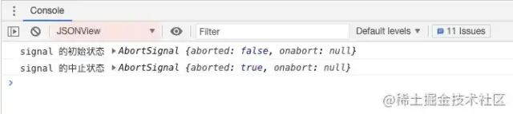
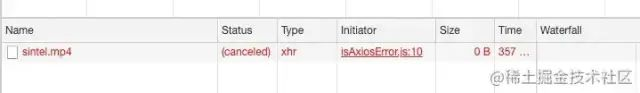
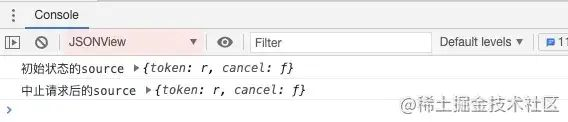
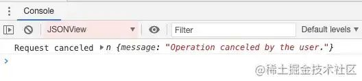

## 1. AbortController

**AbortController**[3] 接口表示一个控制器对象，可以根据需要终止一个或多个Web请求。

- **AbortController()**：AbortController()构造函数创建一个新的 AbortController 对象实例
- **signal**：signal 属性返回一个 AbortSignal 对象实例，它可以用来 with/about 一个Web(网络)请求
- **abort()**：终止一个尚未完成的Web(网络)请求，它能够终止 fetch 请求，任何响应Body的消费者和流

## 2. Fetch 中断请求

Fetch 是 Web 提供的一个用于获取资源的接口，如果要终止 fetch 请求，则可以使用 Web 提供的 AbortController 接口。

首先我们使用 AbortController() 构造函数创建一个控制器，然后使用 AbortController.signal 属性获取其关联 AbortSignal 对象的引用。当一个 fetch request 初始化时，我们把 AbortSignal 作为一个选项传递到请求对象 (如下：{signal}) 。这将信号和控制器与获取请求相关联，然后允许我们通过调用 AbortController.abort() 中止请求。

```
const controller = new AbortController();
let signal = controller.signal;
 console.log('signal 的初始状态: ', signal);

const downloadBtn = document.querySelector('.download');
const abortBtn = document.querySelector('.abort');

downloadBtn.addEventListener('click', fetchVideo);

abortBtn.addEventListener('click', function() {
  controller.abort();
 console.log('signal 的中止状态: ', signal);
});

function fetchVideo() {
  //...
  fetch(url, {signal}).then(function(response) {
    //...
  }).catch(function(e) {
    reports.textContent = 'Download error: ' + e.message;
  })
}
复制代码
```

当我们中止请求后，网络请求变成了如下所示的情况：


我们再来看看 AbortSignal 中止前和中止后的状态：



可以看到，AbortSignal 对象的 aborted 属性由初始时的 false 变成了中止后的 true 。

> **线上运行示例**[4] (代码来源于**MDN**[5])

AbortControllter 有兼容性问题，如下：


## 3. axios 中断请求

axions 中断请求有两种方式：

**方式一**

使用 CancelToken.souce 工厂方法创建一个 cancel token，代码如下：

```
const CancelToken = axios.CancelToken;
const source = CancelToken.source();

axios.get('https://mdn.github.io/dom-examples/abort-api/sintel.mp4', {
  cancelToken: source.token
}).catch(function (thrown) {
  // 判断请求是否已中止
  if (axios.isCancel(thrown)) {
    // 参数 thrown 是自定义的信息
    console.log('Request canceled', thrown.message);
  } else {
    // 处理错误
  }
});

// 取消请求（message 参数是可选的）
source.cancel('Operation canceled by the user.');
复制代码
```

中止后的网络请求变成如下所示：



我们再来看看初始时和中止后的 souce 状态：



可以看到，初始时和中止后的 source 状态并没还有发生改变。那么我们是如何判断请求的中止状态呢？axios 为我们提供了一个 isCancel() 方法，用于判断请求的中止状态。isCancel() 方法的参数，就是我们在中止请求时自定义的信息。



**方式二**

通过传递一个 executor 函数到 CancelToken 的构造函数来创建一个 cancel token：

```
const CancelToken = axios.CancelToken;
let cancel;

axios.get('/user/12345', {
  cancelToken: new CancelToken(function executor(c) {
    // executor 函数接收一个 cancel 函数作为参数
    cancel = c;
  })
});

// 取消请求
cancel('Operation canceled by the user.');
复制代码
```

浏览器运行结果与**方式一**一致，此处不再赘述。

> **线上运行示例**[6] (代码来源于**MDN**[7])

## 4. umi-request 中断请求

umi-request 基于 fetch 封装, 兼具 fetch 与 axios 的特点, 中止请求与 fetch 和 axios 一致不再过多赘述，详情可见官方文档 **中止请求**[8]

需要注意的是 AbortController 在低版本浏览器polyfill有问题，umi-request 在某些版本中并未提供 AbortController 的方式中止请求。

## 5. umi 项目中使用 CancelToken 中止请求

umi 项目中默认的请求库是umi-request，因此我们可以使用umi-request提供的方法来中止请求。另外，在umi项目中可以搭配使用了dva，因此下面简单介绍下在dva中使用CancelToken中止请求的流程。

1、在 services 目录下的文件中编写请求函数和取消请求的函数

```
import request from '@/utils/request';
const CancelToken = request.CancelToken;
let cancel: any;

// 合同文件上传 OSS
export async function uploadContractFileToOSS(postBody: Blob): Promise<any> {
  return request(`/fms/ossUpload/financial_sys/contractFile`, {
    method: "POST",
    data: postBody,
    requestType: 'form',
    // 传递一个 executor 函数到 CancelToken 的构造函数来创建一个 cancel token
    cancelToken: new CancelToken((c) => {
      cancel = c
    })
  })
}

// 取消合同文件上传
export async function cancelUploadFile() {
  return cancel && cancel()
}
复制代码
```

2、在 models 中编写 Effect：

```
*uploadContractFileToOSS({ payload }: AnyAction, { call, put }: EffectsCommandMap): any {
  const response = yield call(uploadContractFileToOSS, payload);
  yield put({
    type: 'save',
    payload: {
      uploadOSSResult: response?.data,
    }
  })
  return response?.data
},

*cancelUploadFile(_: AnyAction, { call }: EffectsCommandMap): any {
  const response = yield call(cancelUploadFile)
  return response

},
复制代码
```

3、在页面中通过dispatch函数触发相应的action：

```
// 发起请求
dispatch({
  type: 'contract/fetchContractFiles',
  payload: {
    contractId: `${id}`,
  }
})

// 取消请求
dispatch({
  type: "contract/cancelUploadFile"
})
   
复制代码
```

4、在 utils/request.js 中统一处理中止请求的拦截：

```
const errorHandler = (error: { response: Response }): Response => {
  const { response } = error;
  notification.destroy()

  if (response && response.status) {
    const errorText = codeMessage[response.status] || response.statusText;
    const { status, url } = response;

    notification.error({
      message: `请求错误 ${status}: ${url}`,
      description: errorText,
    });
  } else if (error?.['type'] === 'TypeError') {
    notification.error({
      description: '您的网络发生异常，无法连接服务器',
      message: '网络异常',
    });
  } else if (error?.['request']?.['options']?.['cancelToken']) {
    notification.warn({
      description: '当前请求已被取消',
      message: '取消请求',
    });
  } else if (!response) {
    notification.error({
      description: '您的网络发生异常，无法连接服务器',
      message: '网络异常',
    });
  } else {
    notification.error({
      description: '请联系网站开发人员处理',
      message: '未知错误',
    });
  }
  return response;
};
复制代码
```