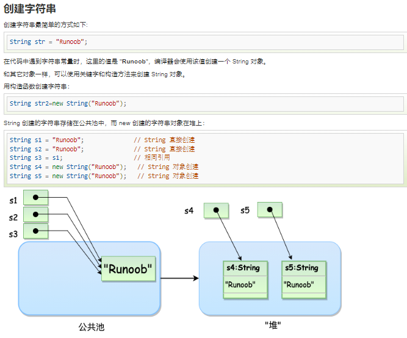

## 1. **String 为什么不可变**

“`String`、`StringBuffer`、`StringBuilder` 的区别？`String` 为什么是不可变的?”

“Java 9 为何要将 String 的底层实现由 `char[]` 改成了 `byte[]` ?”



### **可变性**

简单的来说：`String` 类中使用 `final` 关键字修饰字符数组来保存字符串，***所以`String` 对象是不可变的***。

```
public final class String implements java.io.Serializable, Comparable<String>, CharSequence {
  private final char value[];
 *//...*
}
```

> 🐛 修正 ：我们知道被 `final` 关键字修饰的类不能被继承，修饰的方法不能被重写，修饰的变量是基本数据类型则值不能改变，修饰的变量是引用类型则不能再指向其他对象。因此，`final` 关键字修饰的数组保存字符串并不是 `String` 不可变的根本原因，因为这个数组保存的字符串是可变的（`final` 修饰引用类型变量的情况）。
>
> `String` 真正不可变有下面几点原因：
>
> 1. 保存字符串的数组被 `final` 修饰且为私有的，并且`String` 类没有提供/暴露修改这个字符串的方法。
> 2. `String` 类被 `final` 修饰导致其不能被继承，进而避免了子类破坏 `String` 不可变。
>
> 相关阅读：**如何理解 String 类型值的不可变？- 知乎提问**[1]
>
> 补充（来自**issue 675**[2]）：在 Java 9 之后，`String` 、`StringBuilder` 与 `StringBuffer` 的实现改用 `byte` 数组存储字符串。
>
> **Java 9 为何要将 `String` 的底层实现由 `char[]` 改成了 `byte[]` ?**
>
> 新版的 String 其实支持两个编码方案：Latin-1 和 UTF-16。如果字符串中包含的汉字没有超过 Latin-1 可表示范围内的字符，那就会使用 Latin-1 作为编码方案。Latin-1 编码方案下，`byte` 占一个字节(8 位)，`char` 占用 2 个字节（16），`byte` 相较 `char` 节省一半的内存空间。
>
> 如果字符串中包含的汉字超过 Latin-1 可表示范围内的字符，`byte` 和 `char` 所占用的空间是一样的。
>
> 这是官方的介绍：https://openjdk.java.net/jeps/254 。

`StringBuilder` 与 `StringBuffer` 都继承自 `AbstractStringBuilder` 类，在 `AbstractStringBuilder` 中也是使用字符数组保存字符串，不过没有使用 `final` 和 `private` 关键字修饰，最关键的是这个 `AbstractStringBuilder` 类还提供了很多修改字符串的方法比如 `append` 方法。

```
abstract class AbstractStringBuilder implements Appendable, CharSequence {
    char[] value;
    public AbstractStringBuilder append(String str) {
        if (str == null)
            return appendNull();
        int len = str.length();
        ensureCapacityInternal(count + len);
        str.getChars(0, len, value, count);
        count += len;
        return this;
    }
   //...
}
```

### **线程安全性**

`String` 中的对象是不可变的，也就可以理解为常量，线程安全。

`AbstractStringBuilder` 是 `StringBuilder` 与 `StringBuffer` 的公共父类，定义了一些字符串的基本操作，如 `expandCapacity`、`append`、`insert`、`indexOf` 等公共方法。`StringBuffer` 对方法加了同步锁或者对调用的方法加了同步锁，所以是线程安全的。`StringBuilder` 并没有对方法进行加同步锁，所以是非线程安全的。

### **性能**

每次对 `String` 类型进行改变的时候，都会生成一个新的 `String` 对象，然后将指针指向新的 `String` 对象。`StringBuffer` 每次都会对 `StringBuffer` 对象本身进行操作，而不是生成新的对象并改变对象引用。相同情况下使用 `StringBuilder` 相比使用 `StringBuffer` 仅能获得 10%~15% 左右的性能提升，但却要冒多线程不安全的风险。

### **对于三者使用的总结：**

1. 操作少量的数据: 适用 `String`
2. 单线程操作字符串缓冲区下操作大量数据: 适用 `StringBuilder`
3. 多线程操作字符串缓冲区下操作大量数据: 适用 `StringBuffer`

### 参考资料

[1] 如何理解 String 类型值的不可变？- 知乎提问: *https://www.zhihu.com/question/20618891/answer/114125846*

[2] issue 675: *https://github.com/Snailclimb/JavaGuide/issues/675*


## 2. **JVM的GC日志**

### GC 日志是什么

**GC的概念？**   GC 就是垃圾回收 （Garbage Collection） 的缩写。

**何为垃圾？**  没有任何引用指向的对象，被JVM视为垃圾。当然，对应的判定算法有：引用计数算法、可达性分析算法。 对应的回收算法有：标记清除、复制、标记整理、分代收集算法。

**GC的日志是什么呢？**  GC日志是java虚拟机产生的一种描述性的文本日志。就像我们开发java程序需要输出log日志一样。JAVA 虚拟机用GC日志来描述，垃圾回收的情况。

### minor GC 和 Major GC

Minor GC，表示新生代GC，指发生在新生代的垃圾收集动作，所有的Minor GC都会触发全世界的暂停（stop-the-world），停止应用程序的线程，不过这个过程非常短。

Major GC：老年代GC，指发生在老年代的 GC，也称之为 Full GC。

### GC 日志有什么用

通过GC日志，我们能直观的看到内存清理的基本工作过程。是快速定位潜在的内存故障和性能瓶颈最直观的信息之一。

了解垃圾回收的一些行为，何时在Young（年轻代）何时在回收Old（老年代），并且展示垃圾回收使用到多少资源。

