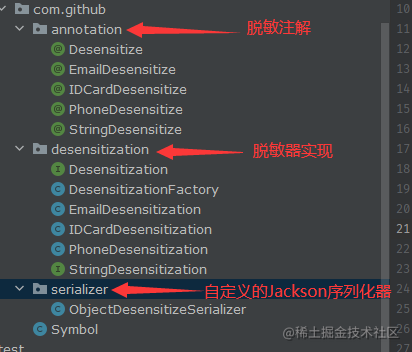

核心思想是利用Jackson的`StdSerializer`,`@JsonSerialize`，以及自己实现的数据脱敏过程

## 使用效果如下:

首先在需要进行脱敏的VO字段上面标注相关脱敏注解


调用接口即可看到脱敏效果


## 实现过程如下:

##### 1. 定义脱敏的过程实现

```javascript
/**
 * Created by EalenXie on 2021/9/24 15:52
 * 顶级的脱敏器
 */
public interface Desensitization<T> {

    /**
     * 脱敏实现
     *
     * @param target 脱敏对象
     * @return 脱敏返回结果
     */
    T desensitize(T target);

}
```

比如具体的手机号脱敏器实现

```javascript
import com.github.Symbol;

import java.util.regex.Matcher;
import java.util.regex.Pattern;

/**
 * Created by EalenXie on 2021/9/24 15:56
 * 手机号脱敏器 默认只保留前3位和后4位
 */
public class PhoneDesensitization implements StringDesensitization {

    /**
     * 手机号正则
     */
    private static final Pattern DEFAULT_PATTERN = Pattern.compile("(13[0-9]|14[579]|15[0-3,5-9]|16[6]|17[0135678]|18[0-9]|19[89])\d{8}");

    /**
     * 手机号脱敏 只保留前3位和后4位
     */
    @Override
    public String desensitize(String target) {
        Matcher matcher = DEFAULT_PATTERN.matcher(target);
        while (matcher.find()) {
            String group = matcher.group();
            target = target.replace(group, group.substring(0, 3) + Symbol.getSymbol(4, Symbol.STAR) + group.substring(7, 11));
        }
        return target;
    }
}
```

##### 2.定义脱敏注解,并指明了使用的序列化器,注解中声明了使用的脱敏器实现

```javascript
package com.github.annotation;

import com.fasterxml.jackson.annotation.JacksonAnnotationsInside;
import com.fasterxml.jackson.databind.annotation.JsonSerialize;
import com.github.desensitization.Desensitization;
import com.github.serializer.ObjectDesensitizeSerializer;

import java.lang.annotation.*;

/**
 * Created by EalenXie on 2021/10/8 11:30
 */
@Target({ElementType.FIELD, ElementType.ANNOTATION_TYPE})
@Retention(RetentionPolicy.RUNTIME)
@JacksonAnnotationsInside
@JsonSerialize(using = ObjectDesensitizeSerializer.class)
@Documented
public @interface Desensitize {
    /**
     * 脱敏器实现
     */
    @SuppressWarnings("all")
    Class<? extends Desensitization<?>> desensitization();
}
```

##### 3. 实现定义的序列化器

```javascript
import com.fasterxml.jackson.core.JsonGenerator;
import com.fasterxml.jackson.databind.BeanProperty;
import com.fasterxml.jackson.databind.JsonSerializer;
import com.fasterxml.jackson.databind.SerializerProvider;
import com.fasterxml.jackson.databind.ser.ContextualSerializer;
import com.fasterxml.jackson.databind.ser.std.StdSerializer;
import com.github.Symbol;
import com.github.annotation.Desensitize;
import com.github.desensitization.Desensitization;
import com.github.desensitization.DesensitizationFactory;
import com.github.desensitization.StringDesensitization;

import java.io.IOException;

/**
 * Created by EalenXie on 2021/8/9 9:03
 * 脱敏序列化器
 */
public class ObjectDesensitizeSerializer extends StdSerializer<Object> implements ContextualSerializer {

    private transient Desensitization<Object> desensitization;

    protected ObjectDesensitizeSerializer() {
        super(Object.class);
    }

    public Desensitization<Object> getDesensitization() {
        return desensitization;
    }

    public void setDesensitization(Desensitization<Object> desensitization) {
        this.desensitization = desensitization;
    }

    @Override
    public JsonSerializer<Object> createContextual(SerializerProvider prov, BeanProperty property) {
        Desensitize annotation = property.getAnnotation(Desensitize.class);
        return createContextual(annotation.desensitization());
    }

    @SuppressWarnings("unchecked")
    public JsonSerializer<Object> createContextual(Class<? extends Desensitization<?>> clazz) {
        ObjectDesensitizeSerializer serializer = new ObjectDesensitizeSerializer();
        if (clazz != StringDesensitization.class) {
            serializer.setDesensitization((Desensitization<Object>) DesensitizationFactory.getDesensitization(clazz));
        }
        return serializer;
    }

    @Override
    public void serialize(Object value, JsonGenerator gen, SerializerProvider provider) throws IOException {
        Desensitization<Object> objectDesensitization = getDesensitization();
        if (objectDesensitization != null) {
            try {
                gen.writeObject(objectDesensitization.desensitize(value));
            } catch (Exception e) {
                gen.writeObject(value);
            }
        } else if (value instanceof String) {
            gen.writeString(Symbol.getSymbol(((String) value).length(), Symbol.STAR));
        } else {
            gen.writeObject(value);
        }
    }
}
```

##### 4.代码的设计说明



完整代码可见 : https://github.com/EalenXie/jackson-desensitize

## 基于Logback的日志脱敏方案

原理是利用Logback的自定义日志转换器`ClassicConverter`

##### 1. 自定义脱敏日志转换器

```javascript
import ch.qos.logback.classic.pattern.ClassicConverter;
import ch.qos.logback.classic.spi.ILoggingEvent;
import com.github.desensitization.EmailDesensitization;
import com.github.desensitization.IDCardDesensitization;
import com.github.desensitization.PhoneDesensitization;
import com.github.desensitization.StringDesensitization;

import java.util.ArrayList;
import java.util.List;


/**
 * @author EalenXie create on 2021/3/18 10:07
 * 此Converter提供支持日志脱敏
 * 1. 编写此LogbackDesensitizeConverter
 * 2. 正则脱敏 手机号/邮箱/身份证
 */
public class LogbackDesensitizeConverter extends ClassicConverter {

    protected static final List<StringDesensitization> DESENSITIZATION_LIST = new ArrayList<>();

    static {
        // 手机号脱敏
        DESENSITIZATION_LIST.add(new PhoneDesensitization());
        // 邮箱脱敏
        DESENSITIZATION_LIST.add(new EmailDesensitization());
        // 身份证脱敏
        DESENSITIZATION_LIST.add(new IDCardDesensitization());
    }

    @Override
    public String convert(ILoggingEvent event) {
        String content = event.getMessage();
        try {
            for (StringDesensitization desensitization : DESENSITIZATION_LIST) {
                content = desensitization.desensitize(content);
            }
        } catch (Exception e) {
            // ig
        }
        return content;
    }
}
```

##### 2. 启动类为`PatternLayout`的静态变量`defaultConverterMap`新增此自定义转换器

```javascript
import ch.qos.logback.classic.PatternLayout;
import com.github.filter.LogbackDesensitizeConverter;
import org.springframework.boot.SpringApplication;
import org.springframework.boot.autoconfigure.SpringBootApplication;
import org.springframework.cloud.client.discovery.EnableDiscoveryClient;

/**
 * @author EalenXie create on 2020/11/24 14:16
 */
@EnableDiscoveryClient
@SpringBootApplication
public class ApiGatewayApplication {
    public static void main(String[] args) {
        // 日志处理方案 新增一个Logback的日志脱敏转换器
        PatternLayout.defaultConverterMap.put("m", LogbackDesensitizeConverter.class.getName());
        SpringApplication.run(ApiGatewayApplication.class, args);
    }
}
```

启动后可以看到日志脱敏效果。

